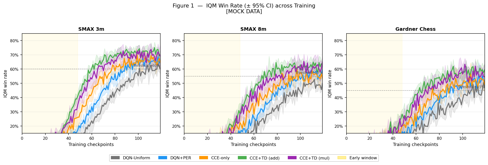
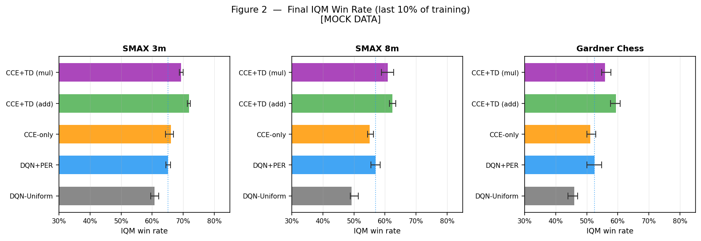
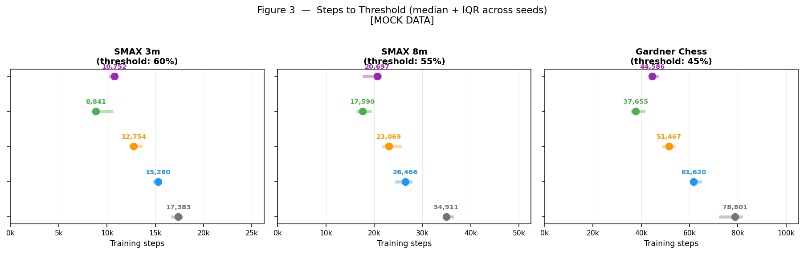
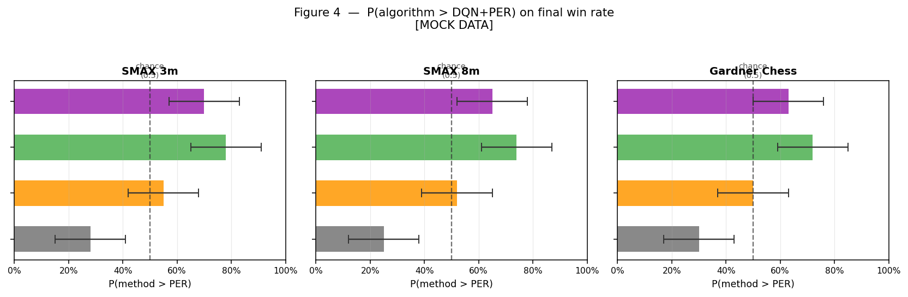
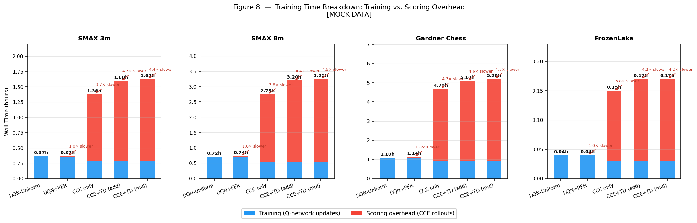
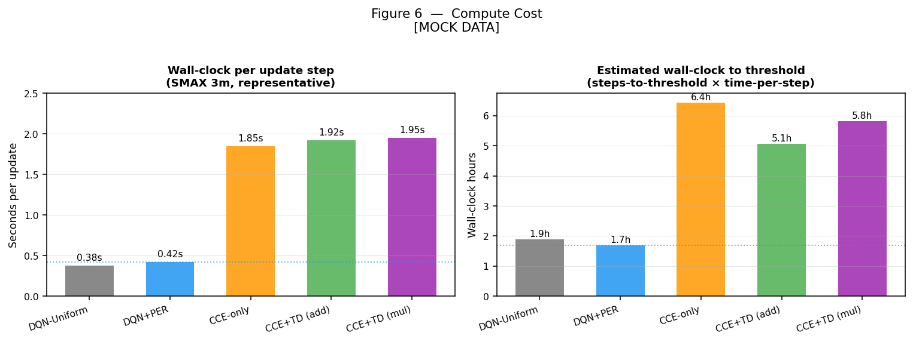
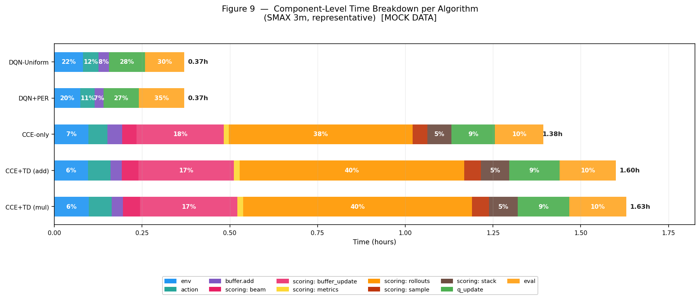

# Claim 2 — Metrics Design

> **Mock figures:** Run `python docs/mock_claim2_figures.py` from the repo root to regenerate
> all example visualizations in `docs/figures/`. All figures use synthetic data — replace
> with real experiment output once runs complete.

**Claim:** CCE leads to more sample-efficient early training — the agent reaches competent play
faster than DQN-Uniform and DQN+PER baselines, without sacrificing asymptotic performance.

**Algorithms compared:**

| Label | Config |
|---|---|
| DQN-Uniform | `algorithm: dqn-uniform` |
| DQN+PER | `algorithm: dqn` |
| DQN+CCE-only | `algorithm: consequence-dqn, mixing: additive, mu: 1.0` |
| DQN+CCE+TD (additive) | `algorithm: consequence-dqn, mixing: additive, mu: 0.25` |
| DQN+CCE+TD (multiplicative) | `algorithm: consequence-dqn, mixing: multiplicative` |

**Environments:** SMAX 3m · SMAX 8m · Gardner Chess · FrozenLake

---

## Pre-registered thresholds

These must be set before looking at results — picking them post-hoc invalidates the
steps-to-threshold claim.

| Environment | Threshold | Rationale |
|---|---|---|
| SMAX 3m | 60% win rate | Well above ~50% random-policy baseline; achievable within 25k episodes |
| SMAX 8m | 55% win rate | Harder scenario; lower bar reflects the difficulty |
| Gardner Chess (vs. pgx ~1000 Elo) | TBD | Set after pilot — observe what a trained DQN+Uniform achieves; expected range 25–45% |
| Gardner Chess (vs. random) | 70% | Secondary sanity check only; not used in rliable pipeline |
| FrozenLake | TBD | Set after pilot run — random policy has ~0% success on slippery 4×4 |

---

## What we track per environment

### Primary signal — win rate (feeds into all rliable metrics)

Win rate is the single scalar that drives every metric below. It is already on [0, 1]
for all environments so no normalization is needed — this is the clean analogue of
what PER does with human-normalized Atari score.

| Environment | Win rate definition | Open question |
|---|---|---|
| SMAX 3m | Fraction of eval battles won by our team | None |
| SMAX 8m | Fraction of eval battles won by our team | None |
| Gardner Chess (primary) | Chess score `(wins + 0.5×draws)/total` vs. pgx ~1000 Elo baseline | Threshold TBD after pilot |
| Gardner Chess (secondary) | Chess score vs. random opponent | Logged for reference only |
| FrozenLake | Fraction of episodes reaching the goal (success rate) | None |

Chess uses the chess-score convention. The W/D/L triple is logged separately in the
`draw_rate` and `loss_rate` columns and reported in the appendix.

**Chess training and evaluation setup:** The agent trains via **self-play** — each game
is played against a frozen copy of itself, updated every K episodes. Self-play is the
correct training mechanism for a two-player zero-sum game and avoids training against a
fixed weak opponent. Evaluation is separate from training and runs against two fixed
opponents every `eval_interval` episodes:

- **pgx ~1000 Elo baseline** (`pgx.make_baseline_model("gardner_chess_v0")`) — the
  primary measuring stick. This is a pre-trained AlphaZero model at ~1000 Elo. Win rate
  against it is what feeds the rliable pipeline and the steps-to-threshold table.
- **Random opponent** — a secondary sanity check. Win rate against random should climb
  quickly once the agent learns legal move masking; it is logged but not used in the
  main analysis.

This separation of training (self-play) and measurement (fixed reference) is what makes
the sample-efficiency learning curves comparable across algorithms.

### Chess secondary signal — W/D/L decomposition (appendix)

Report wins, draws, and losses as a triple in the appendix. The chess-score scalar
aggregates this information, but reviewers familiar with chess expect to see the raw
breakdown — an agent that draws frequently is playing differently (and arguably better)
than one that only wins or loses. This is the AlphaZero standard.

**Format:** For each algorithm at convergence, report `(W%, D%, L%)` where
`W + D + L = 100%`. A single table in the appendix, one row per algorithm.

**Implementation:** Track `state.terminated` and `state.rewards` at episode end —
`rewards[0] = 1` → win, `rewards[0] = 0` with terminated → draw, `rewards[0] = -1` → loss.
Aggregate across seeds and eval episodes.

### SMAX secondary signal — mean allies alive at battle end (appendix)

For each eval battle, record how many allied units survived at episode termination.
This gives texture to win/loss outcomes — a 3-0 wipeout win is better than a 1-0 win.
An agent that improves CCE-scored transitions should learn to preserve units while
still winning, so this is a soft mechanistic check.

**Format:** IQM across seeds of mean allies alive per completed battle, plotted as a
secondary curve alongside the win-rate curve. One panel per SMAX scenario (3m / 8m).

**Implementation:** The SMAX step info dict includes unit health at each step; allies
alive = count of allied units with `health > 0` at the terminal step of each episode.
Parse from existing eval logs — this is already available in the JaxMARL SMAX state.

### Secondary signal — episode length (separate plots, not in rliable pipeline)

Episode length curves use the same IQM + CI style as win rate but are presented as
separate figures. They answer a different question: not whether the agent wins, but
how efficiently it plays.

| Environment | Episode length definition | What it tells you |
|---|---|---|
| SMAX 3m | Steps per battle | Shorter wins = more decisive; longer losses = agent is competitive |
| SMAX 8m | Steps per battle | Same as 3m |
| Gardner Chess | Moves per game | Very long games = two weak agents; shorter = more decisive play |
| FrozenLake | Steps per episode (all episodes, including failures) | Path efficiency — shorter = smarter route to goal. Note: failed episodes inflate the mean since they run to the step limit; the relative ordering across algorithms remains meaningful. |

---

## Metrics

### 1. IQM Learning Curves with Bootstrap CIs

**Question answered:** How does per-seed-averaged performance evolve across training,
and how much uncertainty is there across seeds?

**What it adds to the paper:** This is the visual backbone of Claim 2. Every other metric
is a scalar summary derived from these curves. A reviewer who doubts the claim will look
here first. It shows the *shape* of the early advantage — whether it is a consistent
head-start or a noisy early spike that regresses.

**Why IQM instead of mean:** The Interquartile Mean trims the top and bottom 25% of seeds
before averaging. With 10 seeds this removes the 2–3 most extreme outcomes, making the
curve robust to the single unlucky or lucky run that would otherwise dominate a mean.
This is the standard recommended by Agarwal et al. 2021 (rliable).

**Why "per env" not aggregated:** With only 4 environments, aggregating IQM across them
produces a number with no statistical meaning — the environments differ in difficulty,
episode length, and win-rate scale. One curve per environment is the correct unit.

**Implementation:**

```python
# pip install rliable
from rliable import library as rly, metrics

# ── What you load from logs ────────────────────────────────────────────────
# raw[alg].shape = (n_seeds, n_envs, n_checkpoints)
#   raw['DQN+PER'][seed_i, env_j, ckpt_t] = win_rate of seed i on env j at checkpoint t

# ── How rliable works ──────────────────────────────────────────────────────
# aggregate_iqm always returns ONE scalar — it never returns a vector by itself.
# To build a learning curve you call get_interval_estimates once per checkpoint,
# each time passing a (n_seeds, n_envs) slice.

iqm_vals = {alg: [] for alg in raw}
ci_lo    = {alg: [] for alg in raw}
ci_hi    = {alg: [] for alg in raw}

for t in range(n_checkpoints):
    scores_at_t = {alg: arr[:, :, t] for alg, arr in raw.items()}
    # scores_at_t[alg].shape = (n_seeds, n_envs)  <- rliable's expected unit
    point, ci = rly.get_interval_estimates(scores_at_t, metrics.aggregate_iqm, reps=50000)
    for alg in raw:
        iqm_vals[alg].append(float(point[alg]))
        ci_lo[alg].append(float(ci[alg][0]))   # lower bound
        ci_hi[alg].append(float(ci[alg][1]))   # upper bound

# Convert to arrays for plotting
iqm_vals = {alg: np.array(v) for alg, v in iqm_vals.items()}  # shape: (n_checkpoints,)
ci_lo    = {alg: np.array(v) for alg, v in ci_lo.items()}
ci_hi    = {alg: np.array(v) for alg, v in ci_hi.items()}

# Plot: x = training steps, y = iqm_vals[alg], shade between ci_lo and ci_hi
```

**Data needed:** Per-seed eval win-rate arrays logged at `eval_interval` checkpoints.
Already recorded in `timing.jsonl` / eval logs from existing training runs. Needs a
parser that extracts `(checkpoint, win_rate)` per seed per algorithm per environment.

**Mock figure:**



Four panels, one per environment (SMAX 3m · SMAX 8m · Chess · FrozenLake). Each has
five algorithm lines (IQM across seeds) with shaded 95% bootstrap CI bands. The gold
shaded region marks the early-training window. The dashed horizontal line marks the
pre-registered threshold. CCE+TD (add) should show a steeper early ramp even if all
algorithms converge by the end. The mock shows 3 panels — regenerate once FrozenLake
experiments are run.

---

### 2. Final IQM Table

**Question answered:** Does CCE sacrifice asymptotic performance to achieve early gains?

**What it adds to the paper:** The honest check. Sample efficiency is only a clean story
if the early-phase advantage does not come at the cost of lower final win rate. If CCE+TD
reaches threshold faster *and* matches DQN+PER at convergence, Claim 2 is unqualified.
If CCE trails at convergence, the paper must say so explicitly — and that is still a valid,
publishable result.

**Definition:** IQM of win rate averaged over the final 10% of training episodes, per
algorithm, per environment. Bootstrap 95% CIs across seeds.

**Implementation:**

```python
from rliable import library as rly, metrics

# Average the last 10% of checkpoints within each seed/env, giving one scalar per (seed, env).
# final_scores[alg].shape = (n_seeds, n_envs)  <- rliable's expected input
final_scores = {}
for alg, arr in raw.items():
    # arr.shape = (n_seeds, n_envs, n_checkpoints)
    cutoff = int(0.9 * arr.shape[2])
    final_scores[alg] = arr[:, :, cutoff:].mean(axis=2)  # -> (n_seeds, n_envs)

# One call returns the scalar IQM + bootstrap CI across all seeds and environments.
point, ci = rly.get_interval_estimates(final_scores, metrics.aggregate_iqm, reps=50000)
# point[alg] -> float   IQM across all seeds × envs
# ci[alg]    -> (2, 1)  [[lower_bound], [upper_bound]]  (95% CI)
# Use float(ci[alg][0]) and float(ci[alg][1]) to extract scalars.
```

**Mock figure:**



Horizontal bar chart per environment. Each bar is the final IQM win rate for one
algorithm, with 95% CI whiskers. The dotted vertical line marks DQN+PER's value as
the baseline reference. The key question: do CCE bars overlap with or exceed PER?

---

### 3. Steps-to-Threshold Table

**Question answered:** How many environment interactions does each algorithm need before
it first reaches competent play?

**What it adds to the paper:** This is the most directly readable operationalization of
"faster." PER's 2016 paper made this claim informally ("reaches equivalent performance at
38–47% of training"). This table formalizes it: a concrete number of steps, per algorithm,
per environment, with uncertainty across seeds.

**Definition:** For each seed, find the first eval checkpoint at which win rate ≥ threshold
(see pre-registered values above). If a seed never crosses the threshold, record `∞` (or
the total training budget, treated as a censored observation). Report median steps-to-threshold
and IQR across seeds.

**Why median not mean:** A single seed that never crosses the threshold would make the mean
infinite. Median is robust to censored observations.

**Implementation:**

```python
import numpy as np

def steps_to_threshold(win_rate_matrix, eval_steps, threshold):
    """
    win_rate_matrix: (n_seeds, n_checkpoints)
    eval_steps:      (n_checkpoints,) — total env steps at each checkpoint
    threshold:       float

    Returns (n_seeds,) array of steps; np.inf if threshold never reached.
    """
    results = []
    for seed_row in win_rate_matrix:
        crossed = np.where(seed_row >= threshold)[0]
        if len(crossed) == 0:
            results.append(np.inf)
        else:
            results.append(eval_steps[crossed[0]])
    return np.array(results)

# Summarize per algorithm per environment:
# median_steps, iqr = np.nanmedian(s), np.subtract(*np.nanpercentile(s, [75, 25]))
# Note: treat np.inf as "did not reach" and flag count separately.
```

**Table format:**

| Algorithm | SMAX 3m (median ± IQR) | SMAX 8m | Chess | FrozenLake |
|---|---|---|---|---|
| DQN-Uniform | … | … | … | … |
| DQN+PER | … | … | … | … |
| DQN+CCE-only | … | … | … | … |
| CCE+TD (additive) | … | … | … | … |
| CCE+TD (multiplicative) | … | … | … | … |

**Mock figure:**



Lollipop chart: one row per algorithm, dot = median steps, horizontal bar = IQR.
Fewer steps (further left) is better. The absolute step counts are labeled above
each dot so the table numbers are readable at a glance. Algorithms that never reach
threshold would appear at the right edge marked with ∞.

---

### 4. P(Method > PER) Bar Chart

**Question answered:** Across independent runs, how reliably does each CCE variant beat
the DQN+PER baseline?

**What it adds to the paper:** Learning curves show the *average* story. This chart shows
the *reliability* of the improvement. An algorithm that beats PER 90% of the time across
seeds is a different claim than one that beats it 60% of the time with high variance. It
directly addresses the reviewer question "but is this statistically significant?"

**Definition:** For algorithms X and PER, and a randomly drawn (env, seed) pair,
P(X > PER) = probability that X's final win rate exceeds PER's. Estimated via stratified
bootstrap across seeds and environments.

**Important caveat:** With 10 seeds × 4 environments = 40 (env, seed) pairs, the
bootstrap CI on P(improvement) will be wide (roughly ±10–15 percentage points). Present
this as directional evidence, not a tight statistical claim. Per-environment bars are more
honest than a single aggregated bar.

**Implementation:**

```python
from rliable import library as rly, metrics

# Uses the same final_scores[alg].shape = (n_seeds, n_envs) as the Final IQM table.
# probability_of_improvement(x, y) requires two separate arrays — x is the candidate
# algorithm, y is the baseline. It cannot be passed directly, so fix y in a lambda.

base_scores = final_scores['DQN+PER']  # (n_seeds, n_envs)

for alg in ['DQN+CCE-only', 'CCE+TD (add)', 'CCE+TD (mul)']:
    p_fn = lambda x, y=base_scores: metrics.probability_of_improvement(x, y)
    point, ci = rly.get_interval_estimates(
        {alg: final_scores[alg]}, p_fn, reps=50000
    )
    # point[alg] -> float  P(alg beats PER on a random seed/env draw)
    # ci[alg]    -> (2, 1) [[lower], [upper]]  95% CI
    # Use float(ci[alg][0]) / float(ci[alg][1]) to extract scalars for plotting.
```

**Mock figure:**



Horizontal bars: each row is one algorithm vs. DQN+PER. The dashed line at 0.5 marks
chance. Wide CI whiskers are expected with 10 seeds — present this as directional
evidence. A bar clearly above 0.5 with its CI not crossing 0.5 would be the
strongest possible result here.

---

### 5. Wall-Clock Cost: Training Time Breakdown + Wall-Clock to Threshold

**Question answered:** Is the sample-efficiency gain in episodes still a gain in real time,
given that CCE adds rollout overhead per update?

**What it adds to the paper:** Compute honesty. CCE runs counterfactual rollouts to score
transitions — that is not free. If CCE needs 30% fewer episodes to reach threshold but
each episode takes 3× longer, the wall-clock benefit is negative. A reviewer will ask this.
Reporting it proactively is stronger than having it raised in review.

**Two sub-figures:**

**5a. Training time breakdown (stacked bar)** — one panel per environment, one bar per
algorithm. Each bar is split into training time (blue, Q-network updates) and scoring
overhead (red, CCE rollouts). Annotated with total hours and the slowdown multiplier
relative to DQN-Uniform (e.g. "4.4× slower"). This is the clearest way to show where
the CCE cost actually comes from and whether the baselines are comparable to each other.
Data source: `timing.jsonl`, summing component durations across all episodes of a run.

**Actual `timing.jsonl` component names** (verified against training code):

| Component | What it measures | Env |
|---|---|---|
| `env` | env.reset() + env.step() per step | SMAX, FrozenLake |
| `action` | forward pass + action selection per step | SMAX, FrozenLake |
| `collect` | vectorized env.step() + action for all parallel games | Chess only |
| `buffer.add` | adding transition to replay buffer | all |
| `update` | full _update() call (outer wrapper) | all |
| `update.q_update` | Q-network backprop only (inside _update) | consequence_dqn only |
| `update.scoring.sample` | uniform buffer sampling | consequence_dqn only |
| `update.scoring.rollouts` | counterfactual vmap rollouts | consequence_dqn only |
| `update.scoring.metrics` | divergence metric computation | consequence_dqn only |
| `update.scoring.buffer_update` | writing scores back to buffer | consequence_dqn only |
| `update.scoring.beam` | beam search for counterfactual states | SMAX + Chess consequence_dqn |
| `update.scoring.stack` | stacking beam results into batched arrays | SMAX + Chess consequence_dqn |
| `eval` | evaluation pass (sparse, written once per eval interval) | all |
| `total` | full training run wall-clock (written once at end) | all |

Training classification: `env`, `action`, `collect`, `buffer.add`, `update`, `update.q_update`, `eval`.
Scoring classification: any component where `'scoring' in component_name`.

**5b. Wall-clock to threshold** — for each algorithm, multiply median steps-to-threshold
(metric 3) by wall-clock time per step. This answers the bottom-line question: even
accounting for the overhead, does CCE reach competent play faster in real time?

**Implementation:**

```python
# 5a — parse timing.jsonl per run, classify components:
TRAINING_COMPS = {'env', 'action', 'collect', 'buffer.add', 'update', 'update.q_update', 'eval'}
training_s, scoring_s = 0.0, 0.0
for entry in timing_log:
    comp, dur = entry['component'], entry['duration_s']
    if 'scoring' in comp:
        scoring_s += dur
    elif comp in TRAINING_COMPS:
        training_s += dur
# total_wall_clock from the single 'total' entry written at run end

# 5b — wall-clock to threshold:
# time_per_step = total_wall_clock_hours / n_episodes
# wc_to_threshold = steps_to_threshold_median * time_per_step
```

**Mock figure — 5a (training time breakdown):**



Four panels, one per environment. Each bar is split into training (blue) and scoring
overhead (red). Baselines (DQN-Uniform, DQN+PER) have negligible red — they have no
rollout cost. CCE variants are 3–5× slower in wall-clock depending on environment.
The multiplier annotation makes the overhead immediately legible. FrozenLake is the
fastest overall; Chess is the most expensive.

**Mock figure — 5b (wall-clock cost summary):**



Left: wall-clock per step by algorithm. Right: wall-clock hours to threshold.
The dotted line marks DQN+PER as the reference. The right panel is the honest
bottom line — if CCE's episode advantage does not outweigh the per-step cost,
the net wall-clock benefit is negative.

**5c. Component-level breakdown (horizontal stacked bar)** — one row per algorithm,
each bar divided into all timing sub-components from the table above. Baselines have
no scoring components at all — their bars are pure training. CCE variants reveal which
specific sub-components dominate (typically `update.scoring.rollouts` and
`update.scoring.buffer_update`). This answers the "where exactly does the overhead go?"
question, useful for future optimization work and for reviewers asking about
implementation efficiency. Data source: `timing.jsonl` — each episode logs elapsed
time per component.

Generated for **all 3 environments** (one panel per env). The component set naturally
differs by env (Chess uses `collect` instead of `env`+`action`; FrozenLake lacks beam/stack
scoring steps), but the same unified plotting function handles all cases — it renders
whatever components are present in timing.jsonl.

**Mock figure — 5c (component breakdown):**



One row per algorithm per environment panel. Baselines have no scoring components —
bars are dominated by `env`/`collect`, `update`, and `eval`. CCE variants show
`update.scoring.rollouts` and `update.scoring.buffer_update` consuming the majority of
wall-clock. Percentage labels inside segments ≥5% of total.

---

---

## Dependency checklist

| Dependency | Status | Action |
|---|---|---|
| `rliable` | In requirements.txt ✓ | — |
| Per-seed eval win-rate logs | Pilot runs complete for FL + Chess smoke; main 10-seed runs pending | Run claim2_main after sweep |
| Episode length logs | Logged as `avg_length` in all envs ✓ | FL uses all-episode avg (see open decision 5) |
| `timing.jsonl` wall-clock data | SMAX + Chess: per-component data ✓; FL: only `total` until timing fix applied | Apply FL timing fix before main run |
| FrozenLake main experiments | Pilot (job 254117) running; claim2_main pending sweep results | Submit after SMAX metric+mu sweep |
| Chess pilot run | Smoke test complete (job 254131); full pilot pending | Submit chess pilot; watch for 32-min JIT cost on first eval; confirm dual eval (pgx + random) is logging correctly |
| Chess pgx baseline eval | Not yet implemented | Add `pgx.make_baseline_model("gardner_chess_v0")` as eval opponent in `chess/dqn.py` and `chess/consequence_dqn.py` before pilot |
| SMAX metric sweep | Pending | Submit claim2_metric_sweep_3m; pick winning metric |
| SMAX mu sweep | Pending sweep results | Submit after metric sweep completes |
| Analysis pipeline smoke test | Not yet verified end-to-end | Run run_analysis.py on FL pilot data before main experiment |

---

## Open decisions

1. **Chess win rate definition** — **Decided: chess score** `(wins + 0.5×draws)/total`.
   The W/D/L triple is logged in `draw_rate`/`loss_rate` columns and reported in the
   appendix. `chess_score` is the column that feeds into the rliable pipeline.

2. **Chess threshold** — TBD vs. pgx ~1000 Elo baseline. The random-opponent threshold
   (70%) is pre-registered as a sanity check only. For the primary metric, run the pilot
   DQN+Uniform chess training first, observe what win rate against the pgx baseline
   stabilizes at, then lock in a threshold (expected 25–45%) before running the full
   5-algorithm sweep. The threshold must be set before looking at any CCE results.

3. **FrozenLake threshold** — TBD. Random policy on slippery 4×4 has ~0% success.
   A pilot run of DQN+Uniform will show what's achievable and when.

4. **FrozenLake variant** — **Decided: 8×8 slippery.** Stochastic transitions make
   CCE scores more meaningful; 8×8 is harder and more representative.

5. **FrozenLake episode length** — track only successful episodes (path efficiency)
   or all episodes (including timeouts)? The training harness logs `avg_length` over
   all episodes (successful and failed). Tracking successful-only would require a
   separate counter not currently in the training code. **Decision: use all-episode
   avg_length for fig_length, with a caption note that failed episodes inflate the
   mean; this is acceptable since the relative ordering across algorithms is still
   meaningful.**

6. **SMAX 8m seed count** — **Decided: 10 seeds**, matching all other environments.
   This is sufficient for P(improvement) bootstrap estimates to be meaningful.

7. **Steps-to-threshold x-axis unit** — for SMAX/FrozenLake, "steps" = episodes.
   For chess, "steps" = total transitions (chunks × n_envs × collect_steps). Define
   these precisely before generating the table so cross-environment comparisons are
   honest.
