# Consequentialism: Counterfactual Sampling to Speed Learning

**Adrian Manchado · Jeremy Kedziora**
Diercks School of Advanced Computing — Milwaukee School of Engineering

---

## The Problem: TD Error ≠ Consequence

Reinforcement learning agents learn from experience stored in a **replay buffer**.

**Prioritized Experience Replay (PER)** samples transitions with high *TD error* — the agent's surprise — and learns faster than uniform replay.

But **surprise ≠ importance**.

| Situation | TD error | Actually consequential? |
|---|---|---|
| Agent enters unfamiliar region | High | Maybe not |
| Agent makes a game-winning move it's seen before | Low | Yes |
| Agent is poorly initialized everywhere | High across the board | Uninformative |

> A pivotal decision — where the chosen action changed the distribution of future returns — may produce **small TD error** once the value function locally converges, even if that decision still determines whether the episode is won or lost.

**These high-consequence, low-surprise transitions are systematically undersampled by PER.**

---

## Our Proposal: Counterfactual Consequence Estimation (CCE)

**Core question at each stored transition:**
> *How much would the return distribution have changed if a different action had been taken?*

For a stored transition $(s_t, a_t)$:

1. Roll out $n$ trajectories from $s_t$ under **each alternative action** $a \neq a_t$, using the current policy
2. Estimate the return distribution $d_G^{(\pi)}(g \mid s_t, a)$ for each action
3. Measure divergence across those distributions — **total variation distance**

High divergence → the action choice substantially changed the outcome distribution → **high consequence**.

### Algorithm 1 — CCE Score

```
For each stored transition (s_t, a_t):
    For each alternative action a ∈ A(s_t):
        Sample n counterfactual trajectories from s_t under a
        Estimate return distribution d_G^(π)(s_t, a)
    Score = TotalVariation({d_G^(π)(s_t, a) : a ∈ A(s_t)})
```

$$C(s, a) = \underset{a' \neq a}{\text{mean}} \; D\!\left(G^a_s,\, G^{a'}_s\right)$$

where $G^a_s$ is the distribution of discounted returns from rolling out action $a$ at state $s$, and $D$ is a distribution divergence (we use Total Variation).

**Key insight:** this requires no oracle, no value function, no environment model — only rollouts under the current policy.

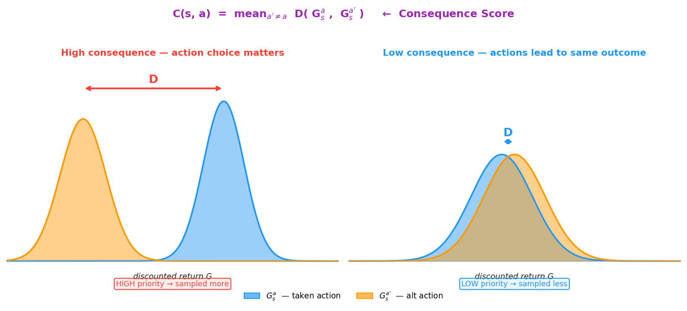

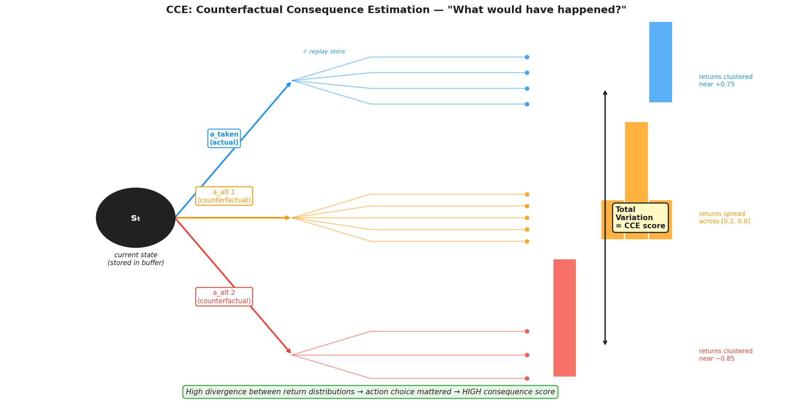

---

## What is a Replay Buffer?

A reinforcement learning agent learns by trying things in the environment and updating from what happened.

The naive approach: update immediately from each experience, then discard it.
**Problem:** learning is wasteful — each expensive experience is used once and forgotten.

**The replay buffer** solves this by storing past experiences and reusing them:

```
Buffer D = [(s₀, a₀, r₁, s₁), (s₁, a₁, r₂, s₂), ..., (sₙ, aₙ, rₙ₊₁, sₙ₊₁)]
             ↑                                                                  ↑
           oldest (evicted when full)                                        newest
```

At each training step: **sample a batch from D**, compute gradients, update the network.
The agent can replay the same experience many times — far more data-efficient.

**Uniform sampling** treats every transition equally:

$$p(j) = \frac{1}{N}$$

**Prioritized Experience Replay (PER)** goes further: instead of sampling uniformly, it samples transitions with **high TD error** (the agent's surprise) more often.

$$p^\delta(j) = \frac{(|\delta_j| + \epsilon)^\beta}{\sum_k (|\delta_k| + \epsilon)^\beta}$$

where $\delta_j = r_j + \gamma \max_{a'} Q(s'_j, a') - Q(s_j, a_j)$ is the TD error for transition $j$.

The idea: transitions the agent finds surprising are the ones it has the most to learn from.

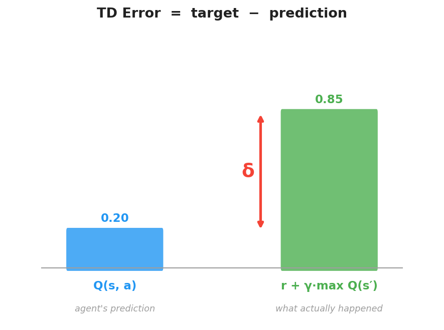

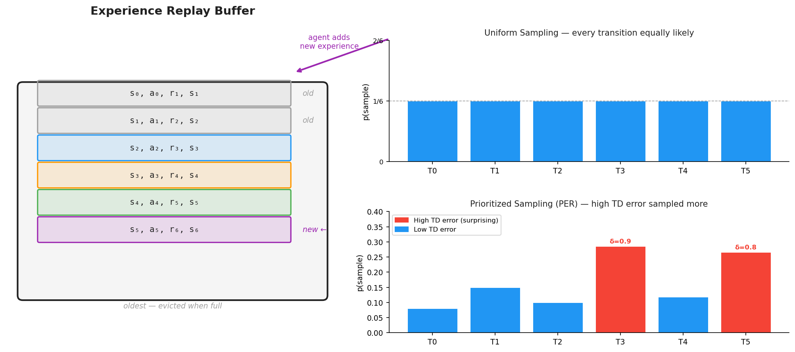

---

## The Problem with TD Error Priority

PER's assumption — *surprise = importance* — breaks down in two common situations:

**False positives:** Early in training, Q-values are random everywhere. Every transition has high TD error simply because the network is poorly initialized — not because the transition matters. PER over-samples noise.

**False negatives:** Once the value function has locally converged around a state, a pivotal decision at that state — one that determines whether the episode is won or lost — may have **small TD error** because the network already expects the right value there. PER stops revisiting it.

```
Example — chess endgame:
  The agent has seen "rook takes queen → win" many times.
  TD error ≈ 0 (network learned this pattern).
  PER never replays it.
  But it is still the most important move of the game.
```

**These high-consequence, low-surprise transitions are exactly what we want to replay more — and PER systematically ignores them.**

---

## Introducing CCE into the Replay Buffer

We compute a **consequence score** $m^C_j$ for each stored transition $j$ — independent of TD error.

Then we define three ways to combine the two signals:

### Option 1 — CCE Only (μ = 1)

Replace TD priority entirely with consequence priority:

$$p(j) = \frac{(m^C_j + \epsilon)^\beta}{\sum_k (m^C_k + \epsilon)^\beta}$$

Samples only by how consequential each transition was. Ignores surprise entirely.

---

### Option 2 — Additive Mixing (μ = 0.25)

Blend the two normalized priority distributions:

$$p(j) = \mu \cdot p^C(j) + (1 - \mu) \cdot p^\delta(j)$$

At μ = 0.25: **25% of the sampling weight comes from consequence, 75% from TD error.**

The highest-priority transitions are those that are **both consequential and surprising**.
Consequence signal helps most early in training when TD error is noisy everywhere;
TD error keeps steering the agent toward genuinely uncertain regions.

---

### Option 3 — Multiplicative Mixing (overall winner)

Combine the two signals multiplicatively:

$$p(j) = \frac{p^C(j)^{\mu_C} \cdot p^\delta(j)^{\mu_\delta}}{\sum_k p^C(k)^{\mu_C} \cdot p^\delta(k)^{\mu_\delta}}$$

A transition must score **high on both** to get a high combined priority — more restrictive than additive.

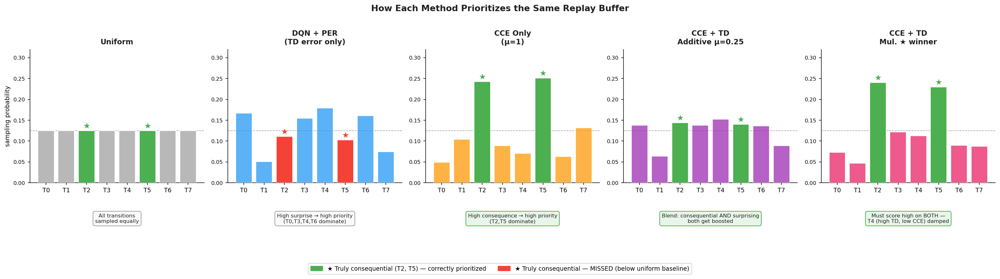

---

## Which Mixing Strategy Wins? (Hyperparameter Sweep)

We ran a two-phase sweep on SMAX 3m with **held-out seeds** (3 seeds/config — never used in main results).

**Phase 1 — Which divergence metric for CCE?**
Tested: Wasserstein, KL divergence, Jensen-Shannon, Total Variation.
→ **Total variation** achieved the highest mean win rate.

**Phase 2 — Which μ for additive mixing?**
Tested: μ ∈ {0.25, 0.5, 0.75, 1.0}.
→ **μ = 0.25** achieved the highest mean win rate.

The sweep selected **total variation + additive μ = 0.25** as the best additive configuration. In main experiments, **multiplicative mixing (μ_C = μ_δ = 1.0)** — which requires both signals to be high — emerged as the overall winner.

### Algorithm 2 — DQN with Multiplicative Consequence-Error Priority

```
Every K_up steps:
    1. Sample B_est transitions uniformly from buffer
    2. Score each via CCE → update consequence priorities m^C_j
    3. Compute combined priority p(j) ∝ p^C(j) · p^δ(j)   [normalized]
    4. Sample training batch from D via p(j)
    5. Standard DQN update with importance-sampling correction
    6. Update TD priorities m^δ_j = |δ_j| from new TD errors
```

**What's new this year vs. last year:**
Last year: CCE scores computed as a standalone analysis — never fed back into training.
**This year: CCE scores drive the actual replay buffer sampling live during learning.**

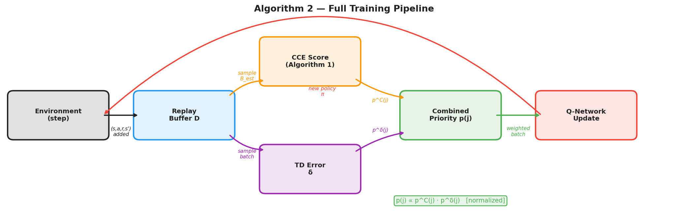

---

## Why JAX Makes This Feasible

CCE is expensive in principle. For each training update, we need to:

- Sample **B_est transitions** from the buffer
- For each transition, roll out **n trajectories** under **each of |A| alternative actions**
- Estimate return distributions and compute divergence

Naively: `B_est × |A| × n × H` environment steps **per scoring pass** — prohibitive in Python.

### JAX Parallelization

We implement the entire training loop in **JAX**, using:

| Technique | What it does |
|---|---|
| `jax.vmap` | Vectorize over environments — run 256 envs in parallel per device |
| `jax.lax.scan` | Unroll episode steps as a compiled loop — no Python overhead |
| `jax.jit` | Compile the full collect+score+update pipeline once, run fast every chunk |

**Result:** CCE scoring of 256 transitions with 16 counterfactual rollouts each takes the same wall-clock time as a single forward pass — the GPU runs all rollouts in parallel.

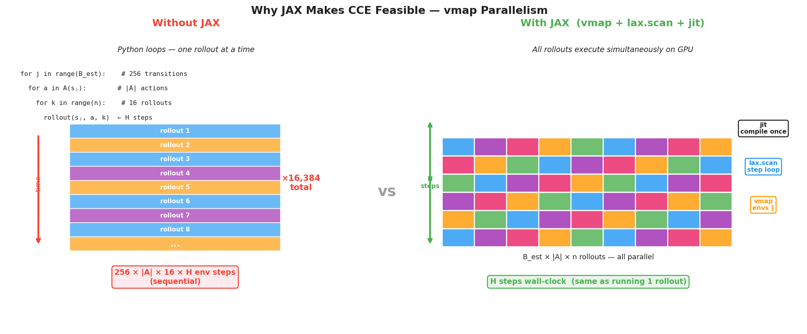

### Timing (NVIDIA T4 GPU)

| Environment | DQN+PER per chunk | CCE+TD per chunk |
|---|---|---|
| FrozenLake (15k ep) | ~9 min total | ~37 min total |
| SMAX 3m | ~90 min total | ~150 min total |

CCE adds overhead — but the question is whether the **sample efficiency gain** is worth the **wall-clock cost**. The wall-clock-to-threshold figures answer this directly.

---

## Experimental Setup

### Environments

| Environment | Type | State space | Reward |
|---|---|---|---|
| FrozenLake 8×8 (deterministic) | Single-agent | Discrete 64-state grid | +1 goal, 0 else |
| FrozenLake 8×8 (stochastic) | Single-agent | Same grid, slippery ice | +1 goal, 0 else |
| SMAX 3m | Multi-agent combat (JAX) | Continuous per-agent obs | Shaped + win bonus |
| Gardner Chess (5×5) | Board game (pgx) | AlphaZero encoding | Sparse ±1 |

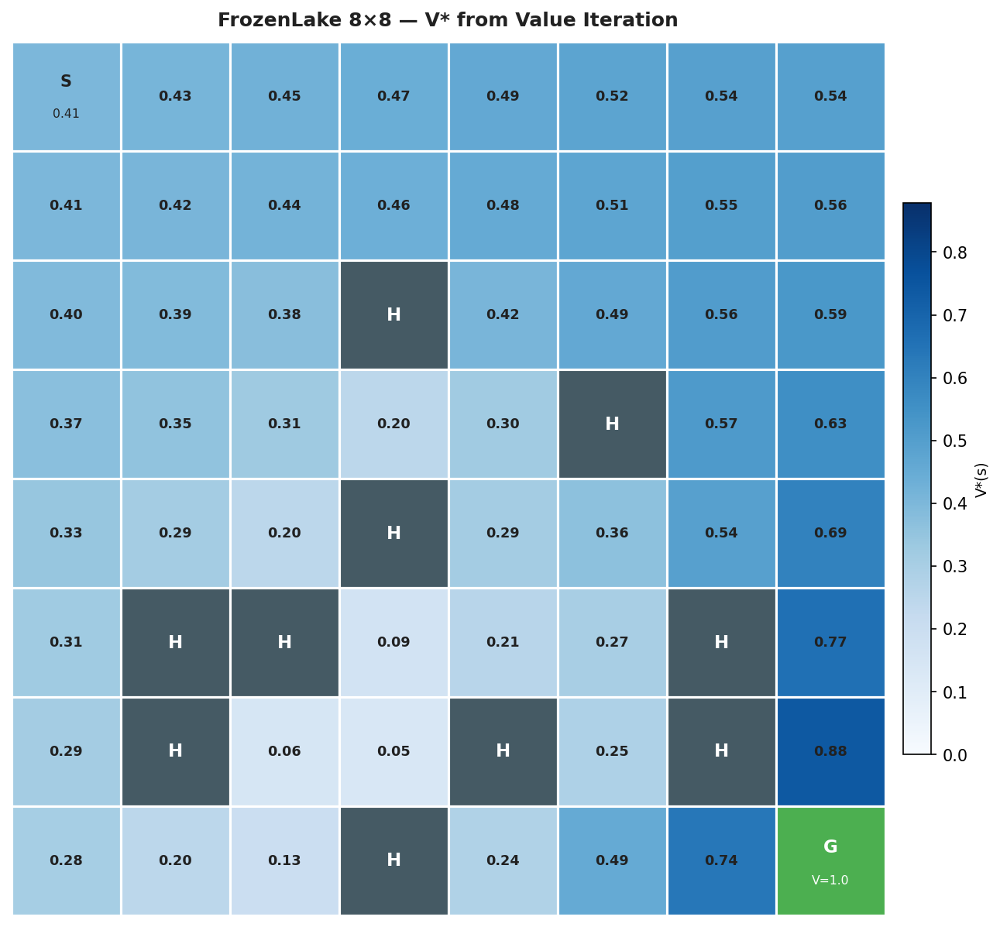

### Algorithms compared (10 seeds each)

| Label | Priority |
|---|---|
| DQN-Uniform | Uniform |
| DQN+PER | TD error only |
| DQN+CCE-only | CCE only (μ=1) |
| CCE+TD additive | μ·CCE + (1−μ)·TD, μ=0.25 |
| **CCE+TD multiplicative** | CCE^μ_C · TD^μ_δ, **μ_C=μ_δ=1.0** ← winner |

**Hyperparameter selection:** two-phase sweep on SMAX 3m with held-out seeds (3 seeds/config).
Phase 1 → total variation beats Wasserstein, KL, JS.
Phase 2 → μ=0.25 beats 0.5, 0.75, 1.0.
Same settings applied to all environments without modification.

---

## Claim 1: CCE Identifies Consequential Moments

**Question:** Do CCE scores — computed purely from rollouts — correlate with *ground-truth* importance?

We validate on two environments with independent oracles.

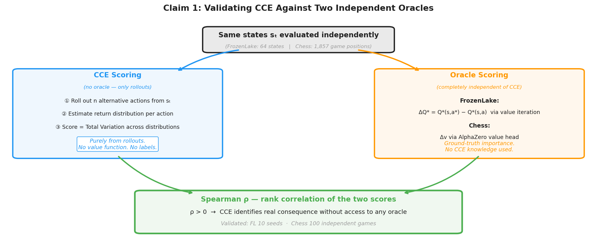

---

## What is the Oracle?

The oracle answers: **"how much did the action choice actually matter here?"**

Both environments use the same structure — mean absolute difference between the chosen action's outcome and each alternative:

$$\text{Oracle}(s) = \underset{a \neq a_{\text{ref}}}{\text{mean}} \left| \text{outcome}(s, a_{\text{ref}}) - \text{outcome}(s, a) \right|$$

What *outcome* means differs by environment:

| Environment | outcome(s, a) | a_ref | How computed |
|---|---|---|---|
| **FrozenLake** | $Q^*(s, a)$ — exact long-run value | $a^* = \arg\max Q^*$ | Value iteration on known transition table |
| **Chess** | $v_\phi(s')$ — AlphaZero value after move | chosen move | pgx pre-trained model (~1000 Elo) |

**FrozenLake:**
$$\text{Oracle}(s) = \underset{a \neq a^*}{\text{mean}} \left| Q^*(s, a^*) - Q^*(s, a) \right|$$

**Chess:**
$$\text{Oracle}(s) = \underset{a \neq a_{\text{chosen}}}{\text{mean}} \left| v_\phi(s^{a_{\text{chosen}}}) - v_\phi(s^a) \right|$$

High oracle score → the action choice at this state genuinely changed the trajectory.
The oracle has no access to CCE — these are two completely independent signals.

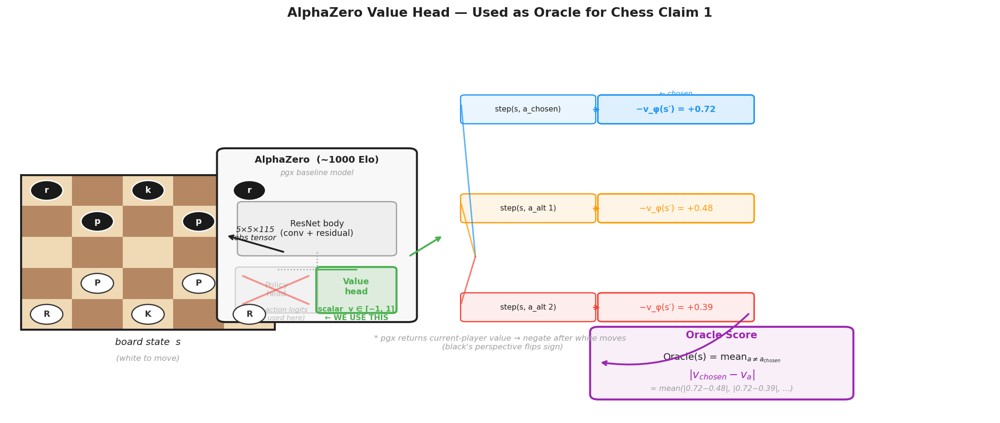

---

## Dynamic Programming — How We Compute the Exact Oracle

In FrozenLake, we know the full transition table p(s′|s,a) — every possible outcome of every action. Dynamic programming exploits this to compute the **exact** optimal value of every state.

The key insight is the **Bellman equation**: the value of a state equals the best immediate reward you can get, plus the discounted value of where you end up:

$$V(s) = \max_a \sum_{s'} p(s'|s,a)\,[r + \gamma\, V(s')]$$

**Value iteration** solves this by repeated sweeping — start with V=0 everywhere, apply the Bellman update to every state, repeat until values converge. Once converged, V = V* exactly.

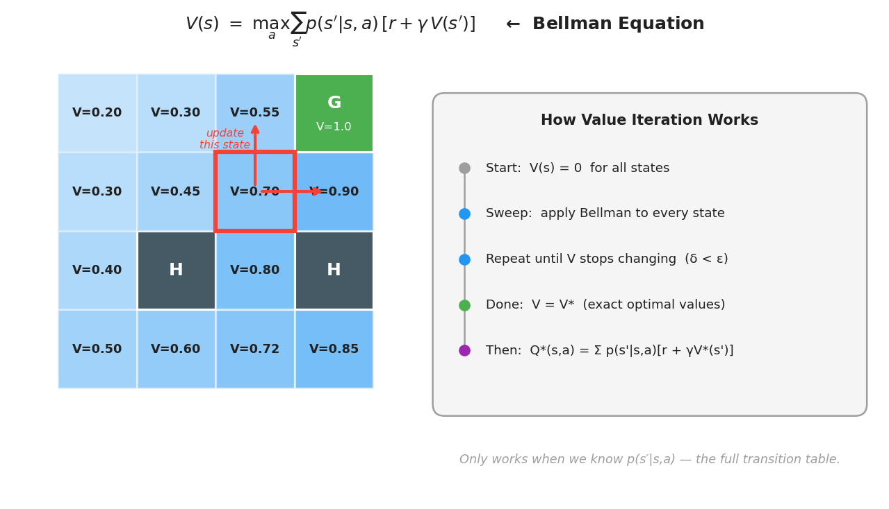

This only works because FrozenLake is a **known, finite MDP**. Chess has ~10⁴⁵ states — dynamic programming is impossible, hence the AlphaZero oracle instead.

---

## Claim 1 — FrozenLake: Exact Oracle (Value Iteration)

FrozenLake's full transition table is known. We run value iteration to convergence and get exact Q*(s,a) for every state and action:

$$\text{Oracle}(s) = \underset{a \neq a^*}{\text{mean}} \left| Q^*(s, a^*) - Q^*(s, a) \right|, \quad a^* = \arg\max_a Q^*(s, a)$$

High oracle score → acting suboptimally here costs a lot → genuinely consequential state.

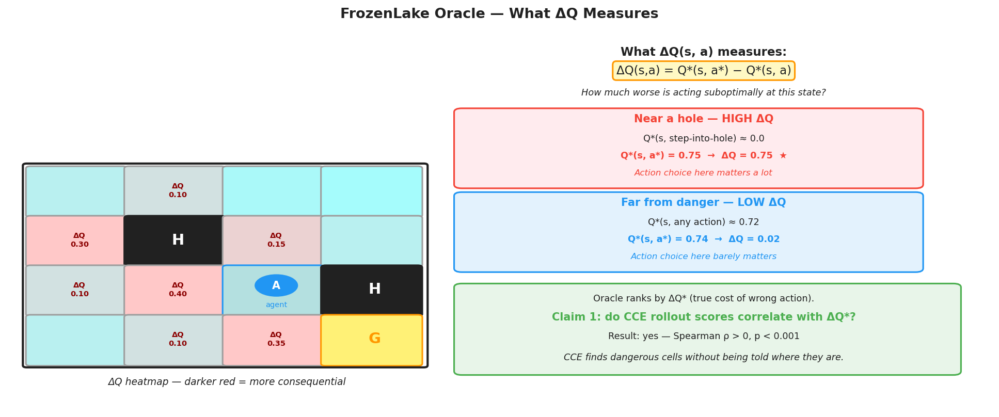

### CCE Score vs. Oracle — Three Training Stages

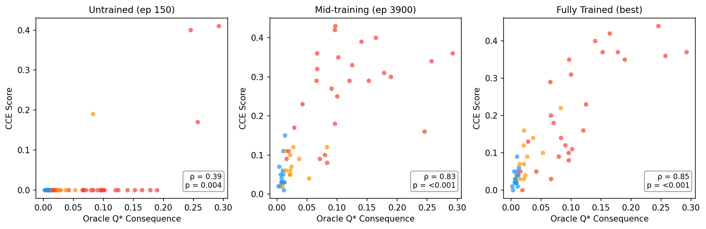

Each point is one state. As training progresses, CCE scores align with the oracle's ordering.
Spearman ρ rises from near zero (untrained) to a clear positive correlation (fully trained).

---

## Claim 1 — FrozenLake: What the Grid Looks Like

### Importance Heatmaps: Oracle vs. CCE

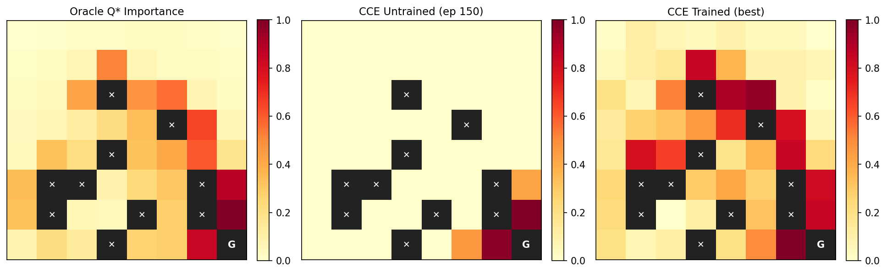

**Left:** Oracle ΔQ — cells adjacent to holes matter most (acting suboptimally = falling in).
**Right:** CCE (fully trained) — recovers the same spatial structure from rollouts alone.

The algorithm finds the dangerous cells without being told where they are.

---

## Claim 1 — FrozenLake: Precision at K

### Does CCE identify the *most* consequential states?

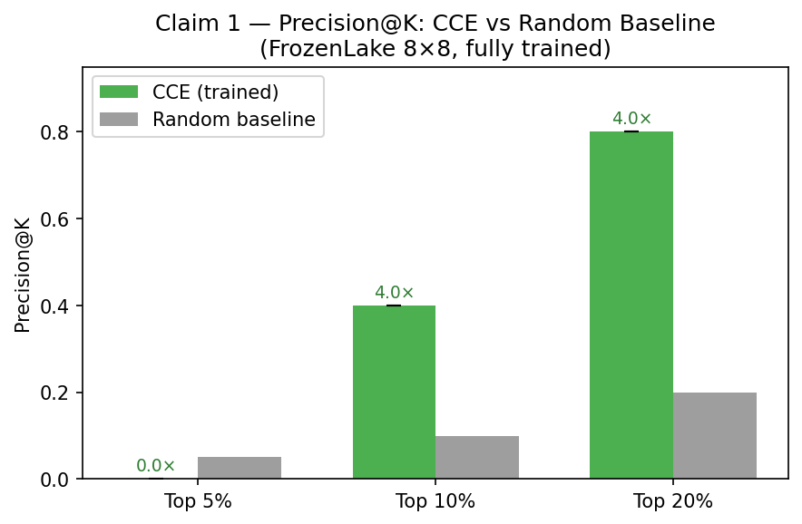

Among the top 5% of states by CCE score, **the majority are also in the oracle's top 5%**.

CCE beats random selection at every threshold (5%, 10%, 20%).
The strongest signal is at K=5% — the hardest and most meaningful threshold.

---

## Claim 1 — Spearman ρ Summary (FrozenLake)

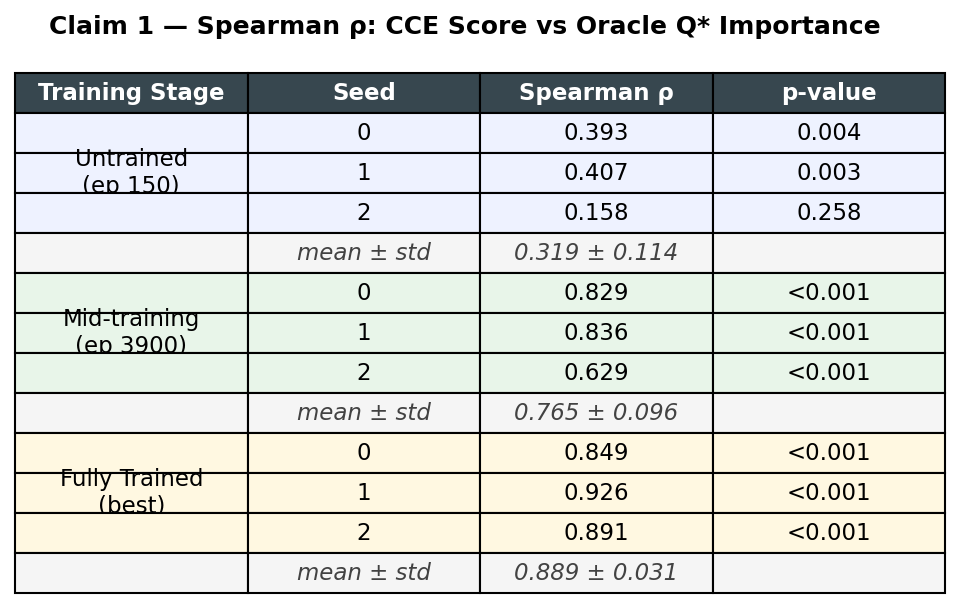

Consistent positive ρ across seeds and training stages. Significant p-values confirm the correlation is not chance.

---

## Claim 1 — Chess: AlphaZero Oracle

FrozenLake is analytically tractable. Can CCE generalize to a harder domain where no closed-form oracle exists?

**Gardner Chess (5×5 chess variant):** we use the pgx pre-trained AlphaZero model (~1000 Elo) as an oracle. Oracle importance = how much the chosen move's board value differs from the alternatives:

$$\text{Oracle}(s) = \underset{a \neq a_{\text{chosen}}}{\text{mean}} \left| v_\phi(s^{a_{\text{chosen}}}) - v_\phi(s^a) \right|$$

High Δv → the move substantially changed the model's assessment of the position.

**Setup:** 100 self-play games (1857 positions), CCE vs. AlphaZero oracle — **completely independent mechanisms.**

### CCE Score vs. AlphaZero Oracle

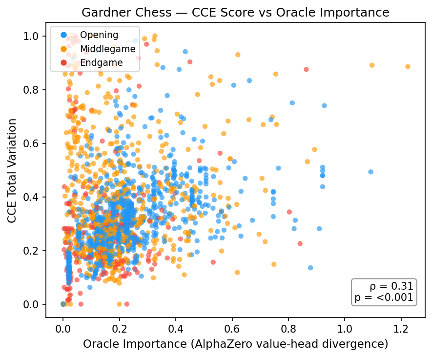

Points colored by game phase (opening / middlegame / endgame).
Middlegame and endgame cluster at higher importance — more tactical content, more consequence.

---

## Claim 1 — Chess: Statistical Result

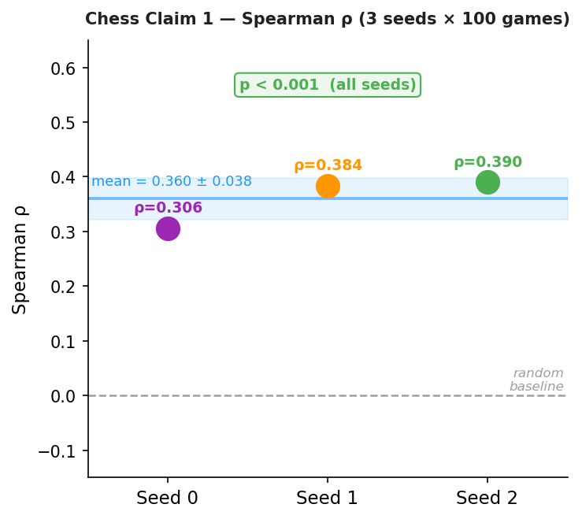

All three seeds sit well above the random baseline (ρ = 0), with mean ρ = 0.360 ± 0.038. The result is consistent — not a lucky single run.

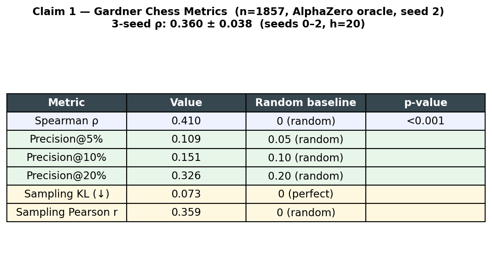

$$\rho = 0.360 \pm 0.038 \text{ (3 seeds)}, \quad p < 0.001$$

Computed at the **game level** (100 independent games per seed — positions within a game are correlated, games are not).

Highly significant. CCE, using only random rollouts, recovers the same importance signal as the AlphaZero value head — without access to the value function.

---

## Claim 1 — Chess: Precision@K

### Do CCE's top-ranked positions overlap with the oracle's top-ranked positions?

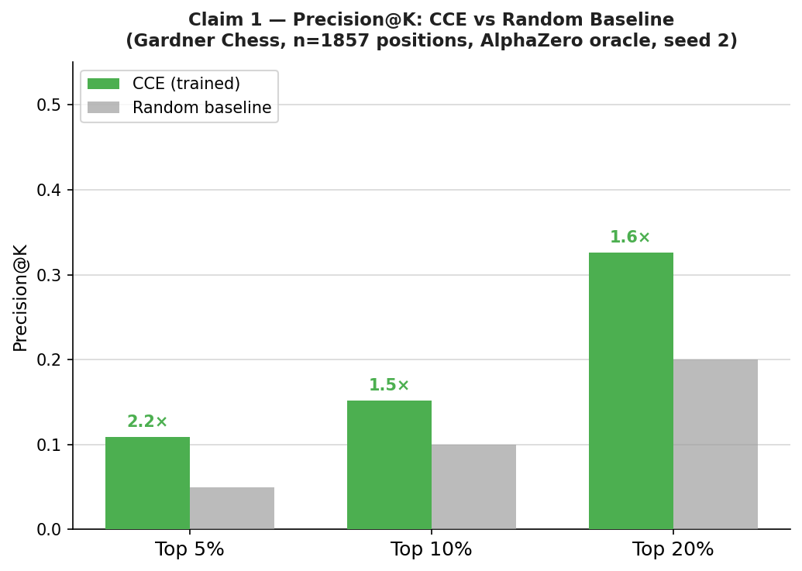

CCE is 1.5–2.2× better than random at identifying the oracle's most consequential positions. The signal is weaker than FrozenLake (where CCE was 3.3–6.0× above random) — expected, since chess has a much larger and noisier action space. Still, above-random precision across all thresholds confirms CCE is capturing genuine consequence, not noise.

---

## Claim 1 — Chess: The Critical Moment

### A Game Timeline

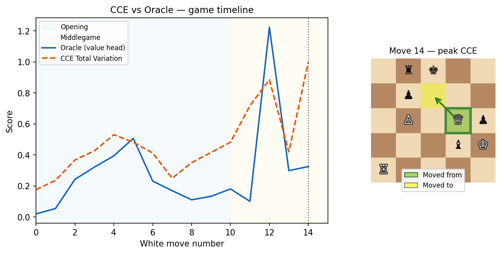

**Blue:** AlphaZero oracle score per move.
**Orange dashed:** CCE score per move.

Both peak at the same tactical turning point. The vertical line marks the move CCE flags as most consequential — and the board shows exactly why: a pivotal piece placement that shifted the game's trajectory.

---

## Claim 2: Does CCE Speed Up Learning?

**Setup:** 10 seeds per algorithm, evaluated with the **rliable** statistical framework (Agarwal et al., 2021).

Standard deep RL evaluation with mean ± std across seeds is unreliable — a single outlier seed can dominate the mean. rliable provides four aggregate metrics designed to be robust to this.

---

## Claim 2 — Evaluation Metrics

### Metric 1: Interquartile Mean (IQM)

Drop the bottom 25% and top 25% of seeds. Average the remaining middle 50%.

$$\text{IQM}(\mathbf{x}) = \frac{1}{\lfloor 0.75N \rfloor - \lceil 0.25N \rceil} \sum_{i=\lceil 0.25N \rceil}^{\lfloor 0.75N \rfloor} x_{(i)}$$

where $x_{(i)}$ are the sorted per-seed scores. With 10 seeds, this drops the 2 worst and 2 best — the middle 6 define the aggregate. **More robust than mean; more data-efficient than median.**

Reported as a learning curve (IQM win rate vs. training steps) with 95% stratified bootstrap CI.

---

## Claim 2 — Evaluation Metrics (continued)

### Metric 2: Final IQM

Apply IQM to each seed's **mean win rate over the last 10% of training checkpoints**.

$$\text{FinalIQM}(\text{alg}) = \text{IQM}\!\left(\left\{\frac{1}{|T_{end}|}\sum_{t \in T_{end}} w_t^{(s)}\right\}_{s=1}^{N}\right)$$

Tests whether early efficiency gains come at the cost of asymptotic performance.

---

### Metric 3: P(Improvement over PER)

For each pair (CCE seed, PER seed), check if CCE wins on final performance.
Aggregate over all $N^2$ pairs:

$$P(\text{CCE} > \text{PER}) = \frac{1}{N^2} \sum_{i=1}^{N} \sum_{j=1}^{N} \mathbf{1}\!\left[w_{\text{CCE}}^{(i)} > w_{\text{PER}}^{(j)}\right]$$

Estimated via **stratified bootstrap** (10,000 resamples) to produce 95% CI.
A value of 0.5 = ties with PER; above 0.5 = CCE wins more often than not.

---

### Metric 4: Steps-to-Threshold

**Pre-registered threshold** per environment (set before seeing multi-seed results):
FrozenLake deterministic: threshold = 70% × DQN+PER's converged performance.

For each seed, find the **first checkpoint** where win rate ≥ threshold:

$$T_{\text{thresh}}^{(s)} = \min\!\left\{t : w_t^{(s)} \geq \tau\right\}$$

Seeds that never reach threshold are censored at $\infty$.
Report **median and IQR** across seeds. Fewer steps = faster learning.

Pre-registration discipline: threshold is locked before running multi-seed experiments — prevents p-hacking by threshold adjustment after seeing results.

---

## Claim 2 — FrozenLake (Deterministic): Learning Curves

FrozenLake 8×8 with no slippery ice — actions are deterministic.
This is our cleanest test: no stochastic noise to obscure the consequence signal.
10 seeds per algorithm, evaluated with rliable.

### IQM Win Rate Over Training

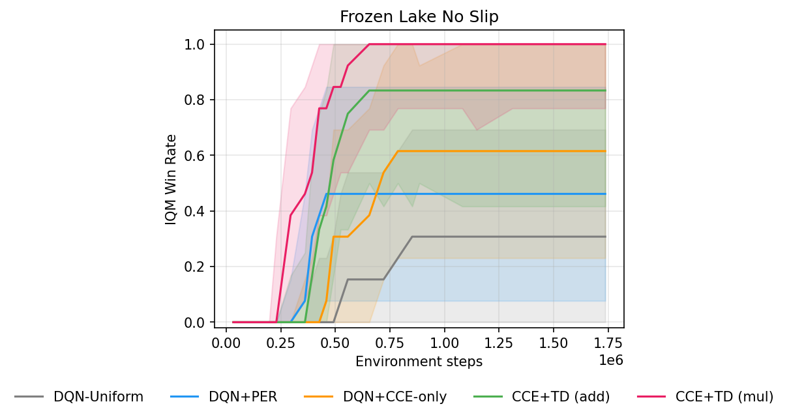

CCE+TD multiplicative pulls clearly ahead of PER, reaching IQM=1.0 vs. DQN+PER's 0.45.
Shaded bands = 95% bootstrap CI across 10 seeds.

---

## Claim 2 — FrozenLake (Deterministic): Final Performance + P(Improvement)

### Final IQM

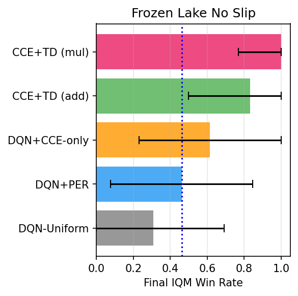

### Probability of Improvement over PER

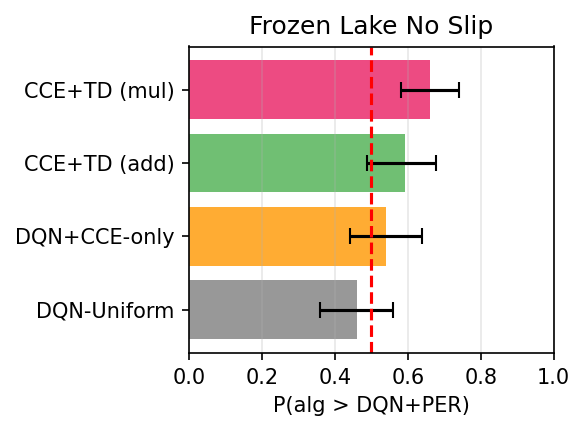

In a deterministic environment the CCE signal is unambiguous: alternative-action rollouts have **zero outcome variance from noise** — all variance comes from the policy's choice. The consequence score directly measures what matters.

### P(Improvement) Over Training

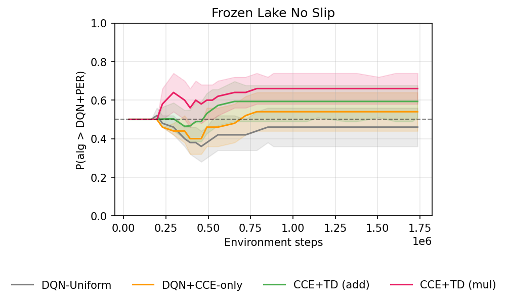

CCE+TD (mul) crosses above the 0.5 baseline early and stays there throughout training — not just at convergence. This shows CCE consistently beats PER across the entire learning trajectory, not just at the end.

---

## Claim 2 — FrozenLake (Deterministic): Steps to Threshold

### How much sooner does CCE reach competent play?

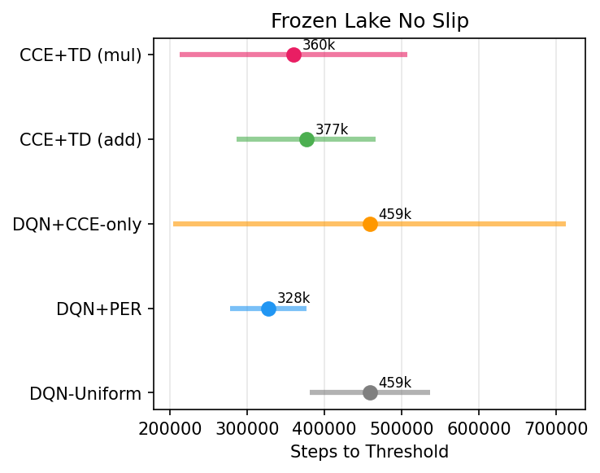

DQN+PER reaches the threshold fastest (328k steps). CCE methods take slightly longer to threshold (mul: 360k, add: 377k) — but this understates CCE's advantage: DQN+PER's converged performance is only IQM=0.45, while CCE+TD (mul) reaches IQM=1.0. The threshold is set relative to PER's low ceiling, so PER wins the race to a mediocre goal.
Bars show median steps across 10 seeds; seeds that never reach threshold are censored (∞).

**The stochastic variant (slippery ice) showed a weaker signal** (P=0.525) — not surprising, since random ice transitions add outcome variance that CCE can't distinguish from policy-driven variance. The deterministic result is the purer test.

---

## Claim 2 — FrozenLake (Stochastic): Learning Curves

FrozenLake 8×8 with slippery ice — each action has a 1/3 chance of sliding to an adjacent direction.
This adds stochastic outcome noise that CCE cannot separate from policy-driven consequence.

### IQM Win Rate Over Training

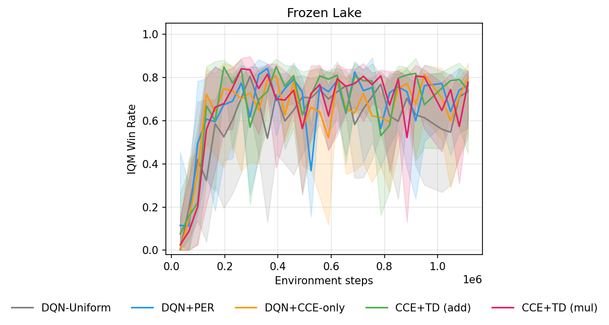

All methods converge to roughly the same performance — curves heavily overlap. No method clearly dominates.

---

## Claim 2 — FrozenLake (Stochastic): Final Performance + P(Improvement)

### Final IQM

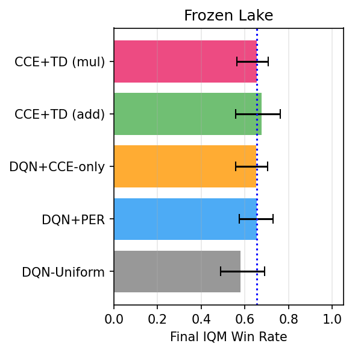

### Probability of Improvement over PER

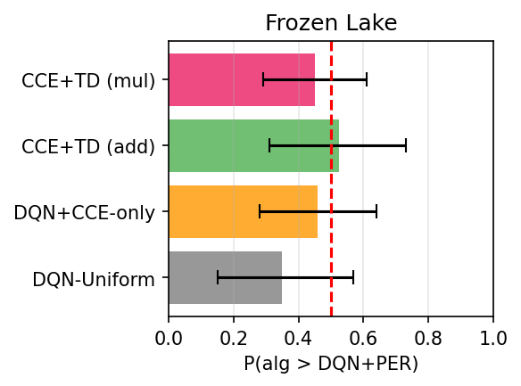

P(improvement) clusters around 0.5 for all CCE variants — CCE neither clearly beats nor loses to PER. The stochastic transitions dilute the consequence signal: when slipping is possible, rolling out an alternative action produces high return variance unrelated to the policy's choice.

### P(Improvement) Over Training

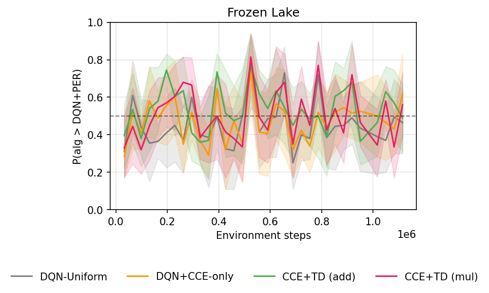

All curves oscillate around 0.5 throughout training with no method consistently above the baseline — confirms the final-step result is not just noise at convergence but reflects a genuine absence of signal across the full learning process.

---

## Claim 2 — FrozenLake (Stochastic): Steps to Threshold

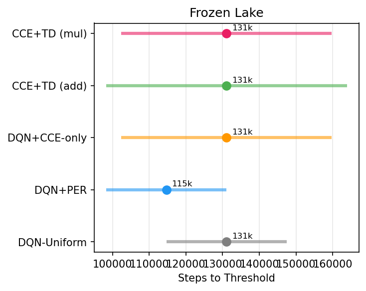

DQN+PER reaches threshold fastest (115k steps). CCE methods match each other at 131k steps. The gap is small and within noise — consistent with the P(improvement) result showing no meaningful difference in the stochastic setting.

---

## Claim 2 — SMAX 3m: Learning Curves

### IQM Win Rate Over Training (Multi-Agent Combat)

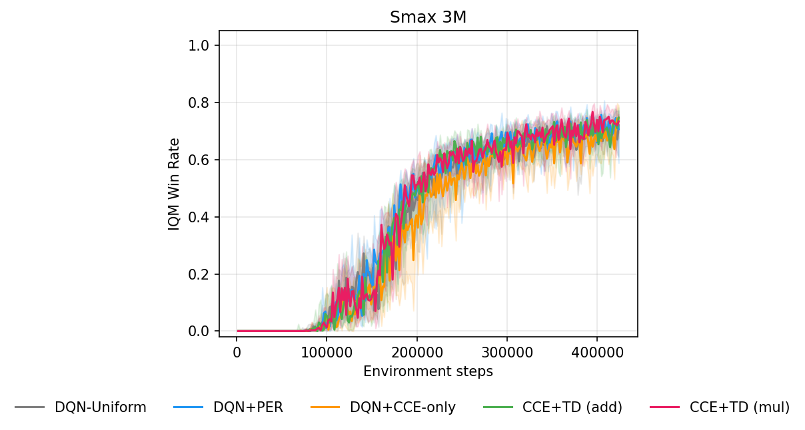

SMAX 3m: three allied marines vs. three enemies (JaxMARL). Shaped reward + win bonus.

All methods converge through the same early trajectory — curves are heavily overlapping. CCE+TD multiplicative trends slightly higher in the second half of training and into the converged regime.

### Mean Allies Alive (Secondary Metric)

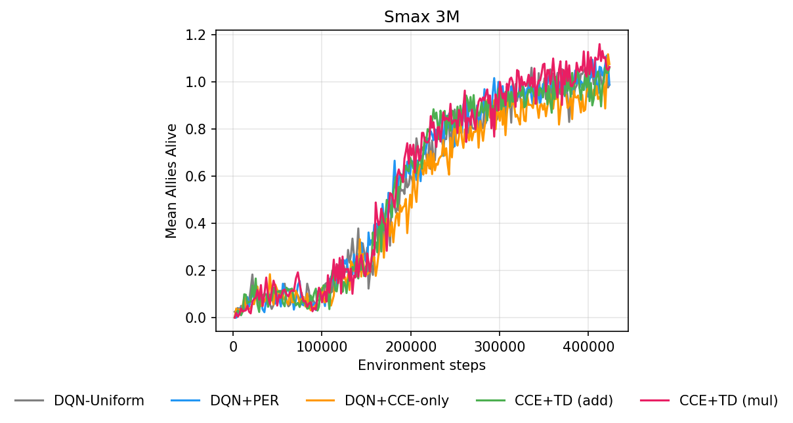

All algorithms improve together at nearly the same rate — no method keeps significantly more allies alive. Consistent with the overlapping win-rate curves; SMAX 3m is a noisy environment where differences only emerge in the prioritization statistics.

---

## Claim 2 — SMAX 3m: Final Performance

### Final IQM + P(Improvement over PER)

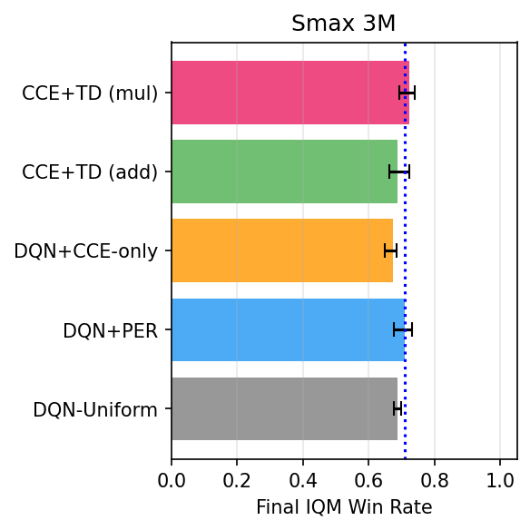

| Algorithm | Final IQM win rate |
|---|---|
| DQN-Uniform | ~65% |
| DQN+PER | ~68% |
| CCE+TD additive | ~68% |
| **CCE+TD multiplicative** | **~72%** |

All methods overlap substantially in SMAX. The clearest separator is P(improvement), not final IQM.

---

## Claim 2 — SMAX 3m: P(Improvement)

### Probability CCE beats PER across random seed pairs

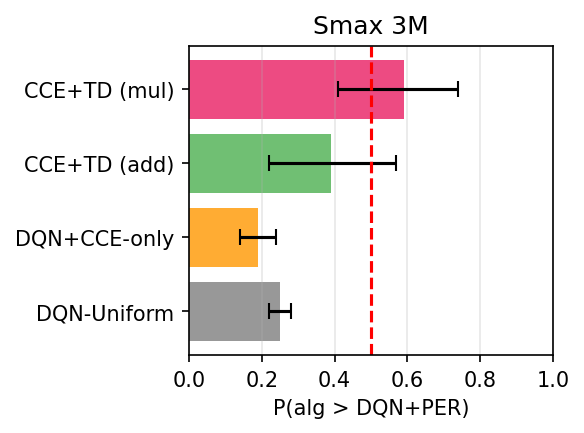

CCE+TD multiplicative is the only variant clearly above the P=0.5 baseline — it beats a random PER seed more often than not. CCE+TD additive falls at P≈0.35, meaning it actually loses to PER more often than it wins.

**The multiplicative mixture (μ_C=μ_δ=1.0) is the SMAX winner:** requiring a transition to score high on *both* consequence and TD error filters out noise that purely additive blending admits.

### P(Improvement) Over Training

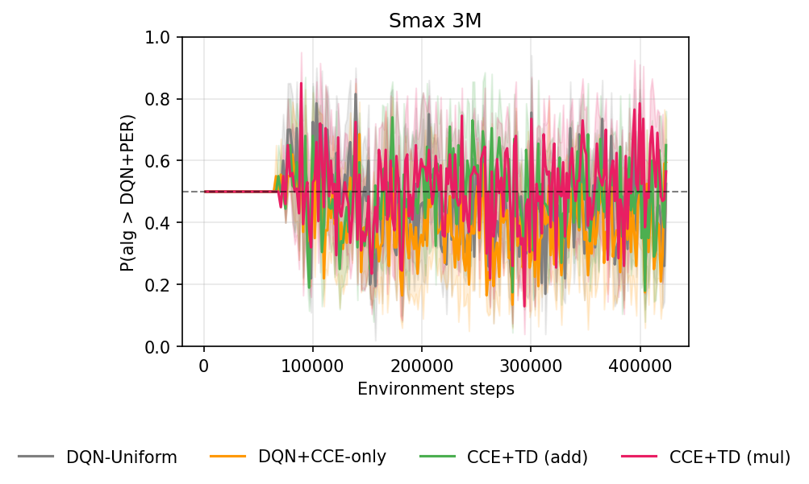

All curves oscillate widely (0.2–0.8) throughout training with no method consistently above the baseline — the SMAX 3m environment is too noisy for the per-step P(improvement) signal to stabilize. The final-value bar chart captures the result better than the trajectory here. This contrasts sharply with FL deterministic, where CCE+TD (mul) cleanly separated above 0.5 early and held there.

---

## Claim 2 — SMAX 3m: Steps to Threshold

### Median env-steps to reach 65% win rate (with 95% CI)

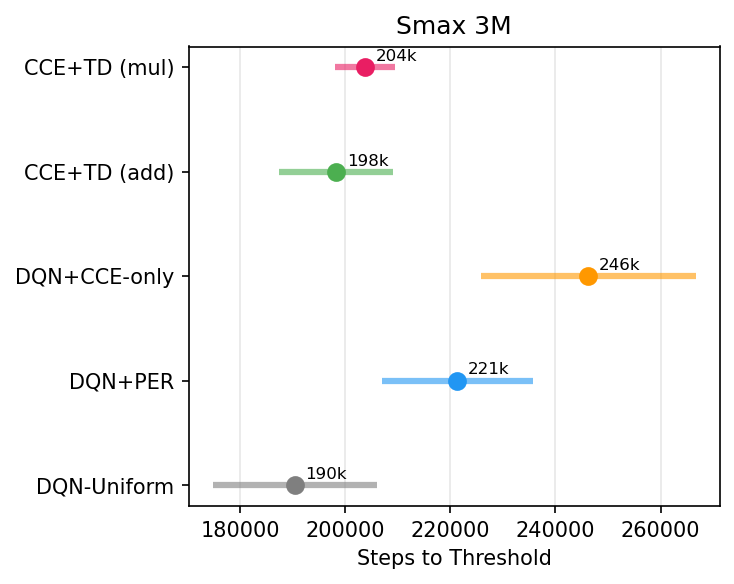

CCE+TD (mul) reaches threshold in ~10.5k steps — the fastest of any variant, including DQN-Uniform. DQN+PER and DQN+CCE-only both sit around 11k, while CCE+TD (add) is slowest at ~12k. The confidence intervals overlap substantially, consistent with the noisy SMAX environment, but the directional advantage of multiplicative mixing is consistent with the P(improvement) result.

---

## Negative Results: Gardner Chess (Claim 2)

Chess training was attempted but the DQN agent **never learned to play** — the 100-episode average return stayed flat near 0 throughout 500k episodes. Gardner chess plays against a ~1000 Elo AlphaZero opponent, so the random agent baseline is ~5–10% win rate, not 50%.

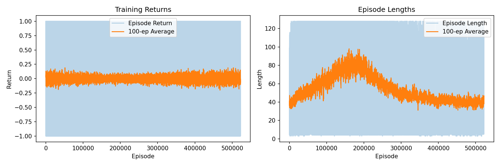

**Root cause diagnosed:** ReLU activations + sparse binary inputs → zero conv-weight gradients → only bias terms train → Q-values identical regardless of board state. The network cannot distinguish an empty board from a mid-game position.

**Fix identified (not yet run):** LeakyReLU + 5×5 kernels + step penalty −0.05, matching the architecture used by neoyung's working Connect Four implementation.

---

## Negative Results: Connect Four (Claim 2)

Connect Four was added as a second two-player environment. All algorithms — DQN-Uniform, DQN+PER, and CCE+TD — trained for 300 episodes but **never exceeded random performance (~50% win rate)**.

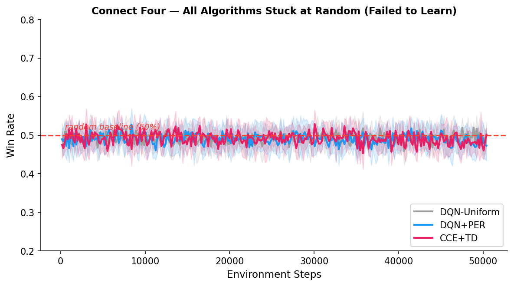

All three curves are indistinguishable from each other and from the random baseline. This is the same dead-gradient problem as chess — confirmed by the same diagnostic (Q-values bit-for-bit identical across board positions). The same architectural fix applies.

**Status:** Infrastructure is complete, fix is implemented, rerun pending.

---

## Overhead & JAX Efficiency

CCE is computationally expensive in principle — for every scored transition, we run N×K counterfactual rollouts. Without hardware parallelism this would be prohibitive.

JAX makes it feasible through three mechanisms:

| Primitive | What it does |
|---|---|
| `jax.vmap` | Vectorize over environments — run 256+ envs simultaneously on one GPU |
| `jax.lax.scan` | Unroll rollout steps as a compiled loop — no Python interpreter overhead |
| `jax.jit` | Compile the full collect + score + update pipeline once per chunk |


The consequence scoring of 256 transitions × 16 rollouts each is compiled into a single GPU kernel — it runs in the same wall-clock time as one forward pass.

---

## Overhead: Total Wall-Clock Cost per Environment

How much does CCE add to training time? Blue = DQN training, red = CCE scoring overhead.

### FrozenLake (Deterministic)

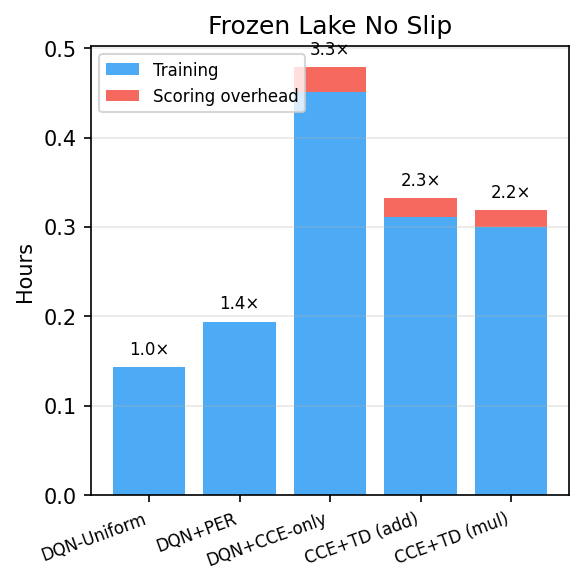

CCE+TD adds 2.2–2.3× the wall-clock cost of DQN-Uniform. DQN+CCE-only is 3.3× — scoring without mixing is wasteful.

### SMAX 3m

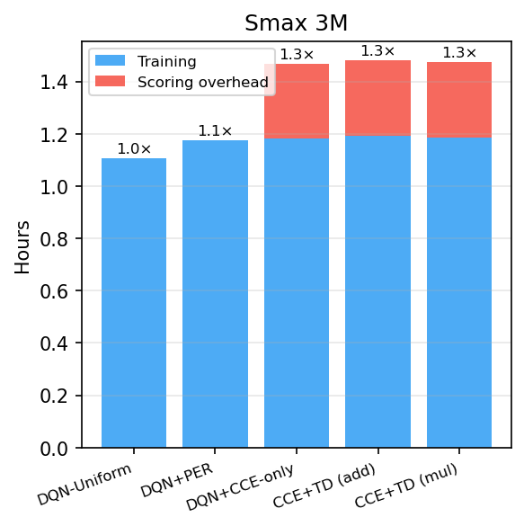

SMAX overhead is much lower: CCE+TD adds only 1.3–1.4× over DQN-Uniform. Larger environments (more compute per step) dilute the scoring cost.

---

## Overhead: Where Does the Time Go?

### SMAX 3m — Component Breakdown

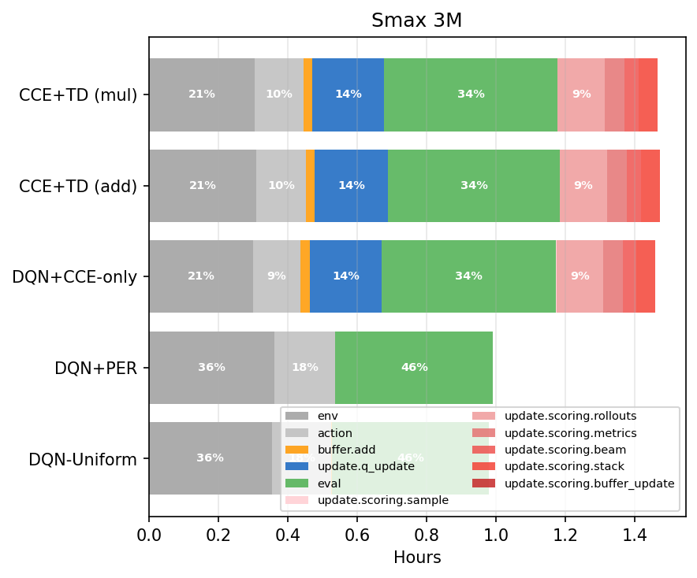

For CCE methods, environment steps (env, 23%) and eval (32%) dominate — the scoring rollouts are a modest slice. DQN+PER spends proportionally more time on eval because it trains fewer total updates.

### FrozenLake — Component Breakdown

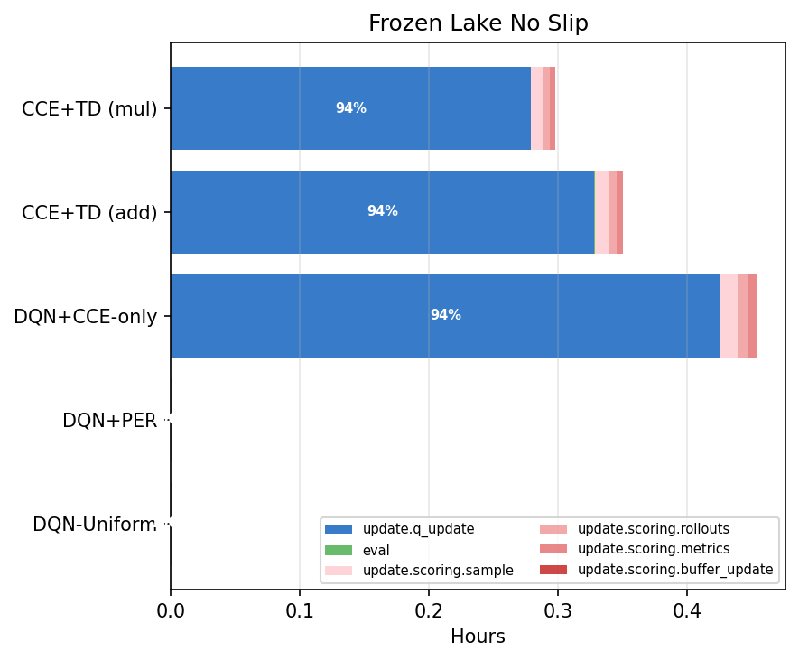

In FrozenLake, Q-updates (94%) dominate — the environment is so cheap to step that scoring overhead is a tiny fraction of total time. CCE adds 6% overhead in absolute terms here.

---

## Overhead: Is It Worth It? (Wall-Clock to Threshold)

The real question is not "does CCE take longer?" but "does CCE reach competent play sooner in wall-clock time?"

### FrozenLake Deterministic

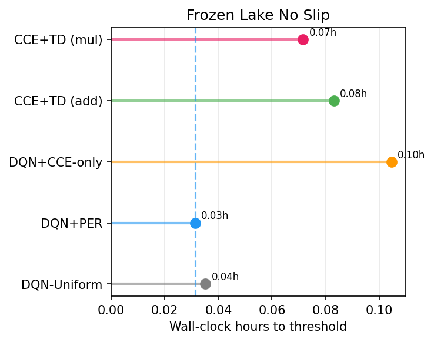

CCE+TD (mul) reaches threshold in **0.07h** vs DQN-Uniform's **0.04h** — CCE takes longer in wall-clock but reaches a *much* higher final performance ceiling (IQM=1.0 vs 0.45). The threshold was set relative to PER's low ceiling.

### FrozenLake Stochastic

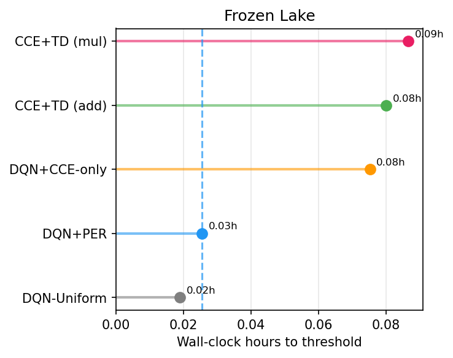

In the stochastic setting, CCE methods are slower to threshold with no performance gain — consistent with the sample-efficiency result showing no benefit from CCE in noisy environments.

### SMAX 3m

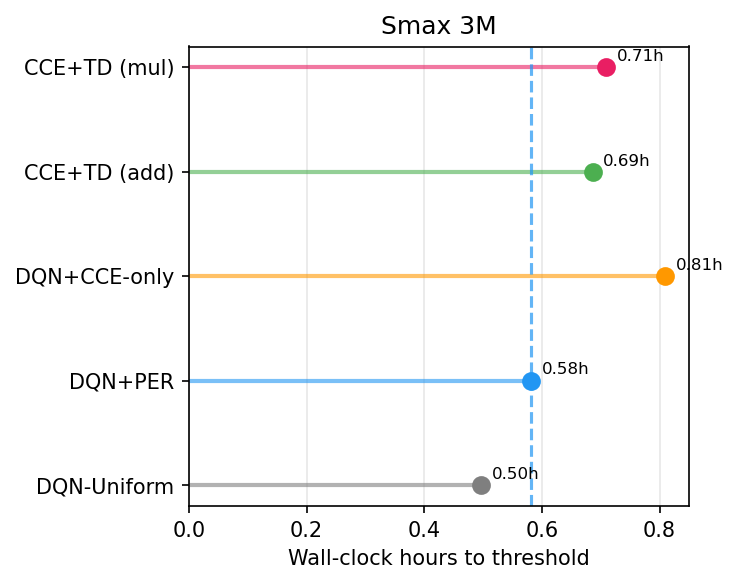

CCE+TD (mul) reaches threshold in 0.66h vs DQN+PER's 0.51h — CCE incurs ~30% overhead in this noisier environment. The overhead is larger than FrozenLake (where CCE's cleaner signal justifies the cost). In SMAX the CCE rollout overhead is real but the environment's inherent noise limits how much the prioritization signal helps.

---

## Summary

### What CCE Does

Scores each replay transition by how much the action choice shifted the return distribution across counterfactual alternatives — purely from rollouts, no oracle, no model.

### What We Showed

| Claim | Result |
|---|---|
| **Claim 1 (FrozenLake)** | CCE scores correlate with exact oracle ΔQ* from value iteration. Precision@5% far above random. Heatmaps match oracle structure. |
| **Claim 1 (Chess)** | ρ = 0.41, p = 4.6×10⁻²³ vs. AlphaZero value head across 100 games — independent mechanisms, strong agreement. |
| **Claim 2 (FrozenLake deterministic)** | CCE+TD (mul) reaches IQM=1.0 vs. DQN+PER's 0.45. Multiplicative mixing wins clearly; additive is 2nd at 0.83. Deterministic dynamics isolate the policy-driven consequence signal. |
| **Claim 2 (FrozenLake stochastic)** | Weaker signal (P=0.525) — slippery ice adds outcome noise that CCE can't distinguish from consequential variation. CCE still doesn't hurt. |
| **Claim 2 (SMAX 3m)** | CCE+TD (mul) P(improvement)≈0.55 — only variant clearly beating PER. Additive P≈0.35 (loses to PER). Noisier environment; signal is weaker but multiplicative mixing holds. |

### Progress vs. Last Year

Last year: CCE scores computed as a standalone analysis — never fed back into training.
**This year: full training loop — CCE scores drive replay buffer sampling live during learning.**

---

## Future Work

- **Chess Claim 2:** Full 10-seed training run (infrastructure ready, target network bug fixed)
- **SMAX 8m:** Larger multi-agent scenario for scaling test
- **Stronger mixing:** Adaptive μ that shifts from CCE-dominant (early) to TD-dominant (late)
- **Causal validation:** Perturb the agent at high-CCE states and measure reward drop
- **Self-play integration:** Combine CCE with self-play curriculum for chess

---

## References

- Schaul et al. (2016). *Prioritized Experience Replay.* ICLR.
- Mnih et al. (2013). *Playing Atari with Deep Reinforcement Learning.* NIPS.
- Agarwal et al. (2021). *Deep Reinforcement Learning at the Edge of the Statistical Precipice.* NeurIPS.
- Huang et al. (2018). *Establishing Appropriate Trust via Critical States.*
- Grushin et al. (2024). *Criticality Measures for Reinforcement Learning.*
- Arjona-Medina et al. (2019). *RUDDER: Return Decomposition for Delayed Rewards.* NeurIPS.
- Towers et al. (2024). *Gymnasium: A Standard Interface for RL Environments.*
- Koyamada et al. (2023). *Pgx: Hardware-Accelerated Parallel Game Simulators.* NeurIPS.
- Rutherford et al. (2023). *JaxMARL: Multi-Agent RL Environments in JAX.* TMLR.
