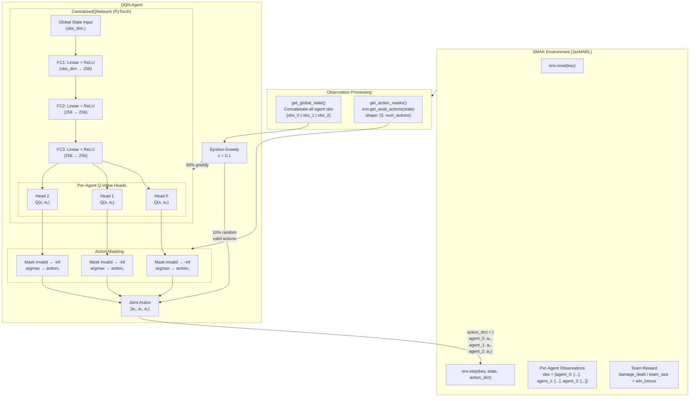
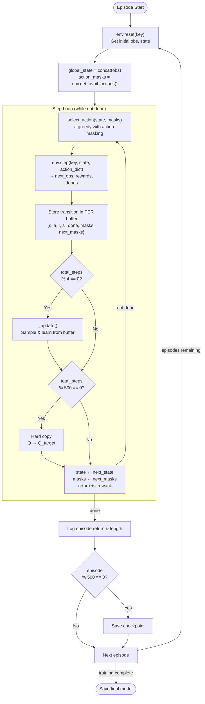
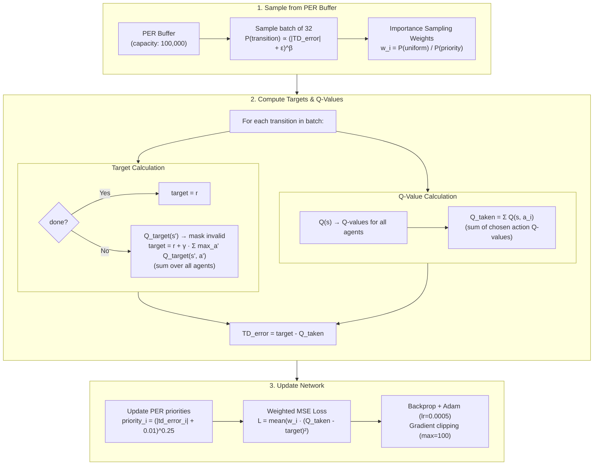
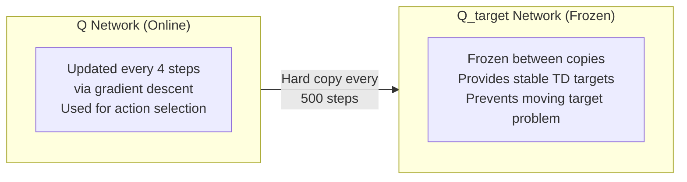
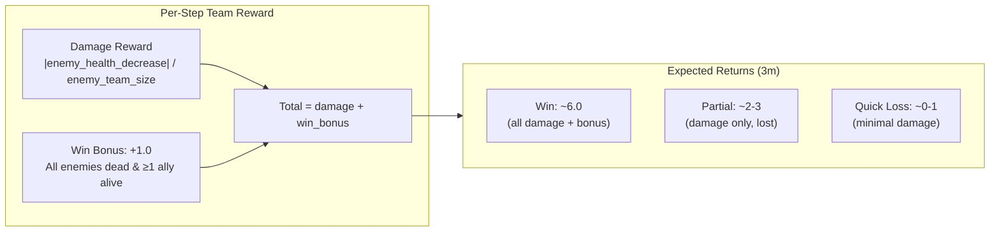

# DQN Training Architecture for SMAX

## System Overview



## Training Loop



## Q-Network Update (_update)



## Two-Network Architecture



## Reward Structure (SMAX 3m)



## Hyperparameters

| Parameter | Value | Description |
|-----------|-------|-------------|
| `gamma` | 0.99 | Discount factor |
| `epsilon` | 0.1 | Exploration rate |
| `alpha` | 0.0005 | Learning rate (Adam) |
| `hidden_dim` | 256 | MLP hidden layer size |
| `M` | 100,000 | Replay buffer capacity |
| `B` | 32 | Batch size |
| `C` | 500 | Target network update frequency (steps) |
| `n_steps_for_Q_update` | 4 | Steps between Q-network updates |
| `PER eps` | 0.01 | Priority smoothing constant |
| `PER beta` | 0.25 | Priority exponent |
| `n_episodes` | 2,000+ | Training episodes |

## File Structure

```
dqn/
├── config.py          # DEFAULT_CONFIG hyperparameters
├── policies.py        # CentralizedQNetwork (shared body + per-agent heads)
├── buffers.py         # PrioritizedReplayBuffer (TD-error priorities)
├── dqn.py             # DQN agent class (.learn(), .save(), .load())
├── utils.py           # SMAX helpers (env creation, state/mask/reward utils)
├── train.py           # CLI entry point (argparse → DQN.learn())
├── visualize.py       # Record trained agent gameplay as GIF
├── train_smax_dqn.sh  # SLURM sbatch for training on Rosie
├── visualize_smax_dqn.sh  # SLURM sbatch for visualization
├── models/            # Saved checkpoints
├── videos/            # Recorded gameplay GIFs
└── logs/              # SLURM job output logs
```
