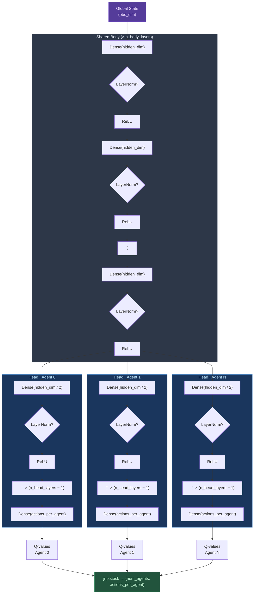

# CentralizedQNetwork Architecture

## Scenario Presets

| Scenario | hidden_dim | n_body_layers | n_head_layers | use_layer_norm | B | alpha |
|---|---|---|---|---|---|---|
| `3m` | 128 | 2 | 1 | No | 32 | 0.0005 |
| `2s3z` | 128 | 3 | 1 | No | 32 | 0.0005 |
| `3s_vs_5z` | 128 | 3 | 1 | No | 32 | 0.0005 |
| `5m_vs_6m` | 192 | 3 | 1 | No | 32 | 0.0005 |
| `3s5z` | 256 | 3 | 2 | Yes | 64 | 0.0003 |
| `8m` | 256 | 3 | 1 | Yes | 64 | 0.0003 |
| `3s5z_vs_3s6z` | 256 | 3 | 2 | Yes | 64 | 0.0003 |
| `10m_vs_11m` | 512 | 4 | 2 | Yes | 128 | 0.0001 |
| `25m` | 512 | 4 | 2 | Yes | 128 | 0.0001 |

When `n_head_layers=1`, the head hidden layers are skipped — each head is just a single `Dense(actions_per_agent)` linear projection (matching the original architecture).
