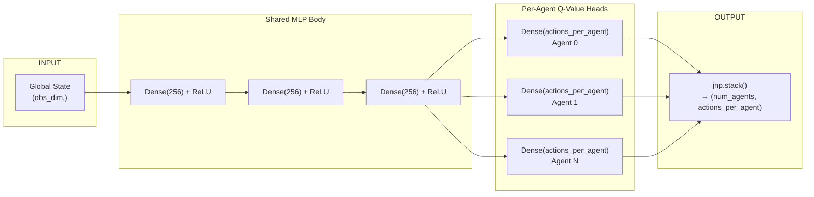
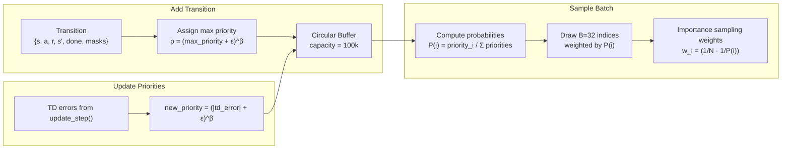

# SMAX DQN Training Architecture (JAX Backend)

## High-Level Overview

This system trains a **centralized DQN** agent to play StarCraft micromanagement scenarios (SMAX) using JAX. A single neural network takes the full global state and outputs Q-values for every agent simultaneously.

---

## Training Flow

```mermaid
flowchart TD
    subgraph INIT["Initialization (train.py)"]
        A1[Parse CLI args\n--backend jax --scenario 3m\n--n-episodes 100000] --> A2[Import JAX DQN backend\ndqn_jax/dqn.py]
        A2 --> A3["Create SMAX env\nHeuristicEnemySMAX(scenario)"]
        A3 --> A4["Instantiate DQN agent\nQ-network + target network\nAdam optimizer + PER buffer"]
    end

    INIT --> LEARN

    subgraph LEARN["agent.learn() — Main Training Loop"]
        direction TB
        L1["Episode Start\nobs, state = env.reset(key)"]
        L1 --> L2["Extract global state\nworld_state OR concat agent obs"]
        L2 --> L3["Get action masks\nvalid actions per agent"]

        L3 --> STEP

        subgraph STEP["Step Loop (while not done)"]
            direction TB
            S1{"random() < epsilon?"}
            S1 -- "Yes (explore)" --> S2["Random valid action\nper agent"]
            S1 -- "No (exploit)" --> S3["JIT: greedy_action()\nQ = network(global_state)\nmask invalid → argmax"]
            S2 --> S4["env.step(state, action_dict)\n→ next_obs, rewards, dones"]
            S3 --> S4

            S4 --> S5["Store transition in PER buffer\n{s, a, r, s', done, masks}"]

            S5 --> S6{"total_steps % 4 == 0?"}
            S6 -- "Yes" --> UPDATE
            S6 -- "No" --> S8

            subgraph UPDATE["Q-Network Update (_update)"]
                direction TB
                U1["Sample batch (B=32) from PER buffer\n→ transitions + importance weights"]
                U1 --> U2["JIT: update_step()"]

                subgraph JIT["JIT-Compiled Gradient Step"]
                    direction TB
                    J1["Q_taken = Σ_agents Q(s,a)\nusing online network"]
                    J1 --> J2["Q_target = Σ_agents max_a' Q(s',a')\nusing target network + masks"]
                    J2 --> J3["TD target = r + γ·Q_target·(1-done)"]
                    J3 --> J4["TD error = target - Q_taken"]
                    J4 --> J5["Loss = mean(IS_weights · TD_error²)"]
                    J5 --> J6["Backprop → clip grads → Adam update"]
                end

                U2 --> U3["Update PER priorities\npriority = (|TD_error| + ε)^β"]
            end

            UPDATE --> S8{"total_steps % C == 0?\n(C=500)"}
            S8 -- "Yes" --> S9["Hard copy:\ntarget_params = copy(params)"]
            S8 -- "No" --> S10[Next step]
            S9 --> S10
        end

        STEP --> L4["Episode ends (done=True)\nRecord return + length"]
        L4 --> L5["Epsilon decay (linear)\nε = 1.0 → 0.05 over 20k episodes"]
        L5 --> L6{"episode % save_every == 0?"}
        L6 -- "Yes" --> L7["Save checkpoint .pkl\nparams, target_params, opt_state"]
        L6 -- "No" --> L8
        L7 --> L8{"episode % eval_interval == 0?"}
        L8 -- "Yes" --> L9["Evaluate (greedy, ε=0)\nvectorized with jax.vmap + lax.scan\n→ win_rate, avg_return"]
        L8 -- "No" --> L10[Next episode]
        L9 --> L10
    end

    LEARN --> POST

    subgraph POST["Post-Training"]
        P1[Final evaluation] --> P2[Plot training curves\nreturns + episode lengths]
    end
```

---

## Neural Network Architecture

**Key design:** Centralized Training with Decentralized Execution (CTDE). The network sees the full world state during training but outputs independent Q-values per agent, so each agent can act using only its own Q-head at inference time.

---

## Prioritized Experience Replay (PER)

Transitions with larger TD errors are sampled more frequently. Importance sampling weights correct the bias so the gradient updates remain unbiased.

---

## File Map

| File | Role |
|------|------|
| `train.py` | Entry point — CLI args, env creation, orchestrates training |
| `config.py` | Default hyperparameters |
| `buffers.py` | `PrioritizedReplayBuffer` — add, sample, update priorities |
| `utils.py` | Env helpers: `create_smax_env`, `get_global_state`, `evaluate`, plotting |
| `dqn_jax/dqn.py` | `DQN` class — learn loop, select_action, JIT update, save/load |
| `dqn_jax/policies.py` | `CentralizedQNetwork` — Flax MLP with per-agent heads |
| `train_smax_dqn.sh` | SLURM submission script — GPU allocation, CUDA libs, launches train.py |

---

## Key Hyperparameters

| Parameter | Value | What it does |
|-----------|-------|-------------|
| `gamma` | 0.9 | Discount factor (how much future rewards matter) |
| `epsilon` | 1.0 → 0.05 | Exploration rate, decays linearly over 20k episodes |
| `alpha` | 0.0005 | Adam learning rate |
| `hidden_dim` | 256 | Width of MLP hidden layers (3 layers) |
| `M` | 100,000 | Replay buffer capacity |
| `B` | 32 | Batch size per gradient step |
| `C` | 500 | Steps between target network hard updates |
| `n_steps_for_Q_update` | 4 | Steps between Q-network gradient updates |