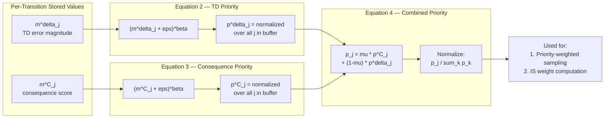
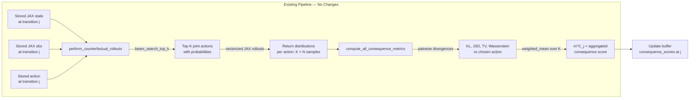
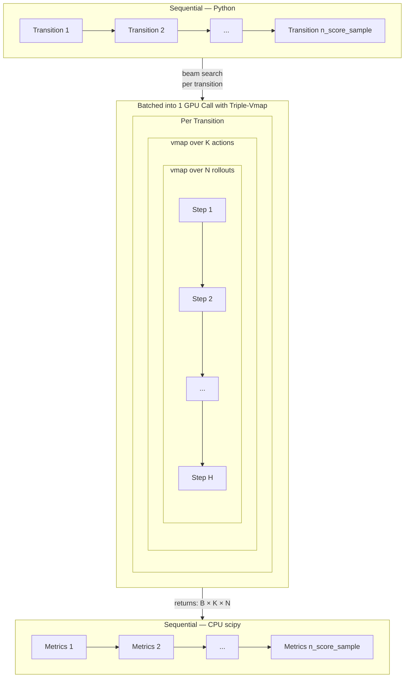

# Consequence-Weighted PER DQN — Algorithm 2

## Agent Learning Flow

```mermaid
flowchart TD
    START([Episode Start]) --> RESET[Reset Environment]
    RESET --> GET_OBS[Get obs, state, action_masks]

    GET_OBS --> SAVE_JAX[Save JAX state & obs\nfor future rollouts]
    SAVE_JAX --> SELECT[Select Action\nepsilon-greedy]
    SELECT --> ENV_STEP[Environment Step\nobs, state, rewards, dones = env.step]

    ENV_STEP --> STORE[Store transition in buffer\nwith JAX state & obs]
    STORE --> INIT_PRIORITY[Initialize priorities\nm^C_t = mean of existing scores\nm^delta_t = max of existing TD mags]

    INIT_PRIORITY --> CHECK_CAP{Buffer > M?}
    CHECK_CAP -- Yes --> EVICT[FIFO evict oldest]
    CHECK_CAP -- No --> INCR
    EVICT --> INCR[total_steps++]

    INCR --> CHECK_Q{t mod K_up == 0?}
    CHECK_Q -- No --> CHECK_DONE
    CHECK_Q -- Yes --> Q_UPDATE_BLOCK

    subgraph Q_UPDATE_BLOCK [Q-Network Update Block]
        direction TB
        INC_Q[q_update_count++] --> CHECK_SCORE{q_update_count mod\nscore_interval == 0\nAND buffer >= n_score_sample?}

        CHECK_SCORE -- Yes --> SCORING
        CHECK_SCORE -- No --> PRI_SAMPLE

        subgraph SCORING [Consequence Scoring Pass]
            direction TB
            REBUILD[Rebuild policy_fn\nwith current Q params] --> UNIFORM[Sample n_score_sample\ntransitions uniformly]
            UNIFORM --> BATCH_ROLLOUTS

            subgraph BATCH_ROLLOUTS [Batched Counterfactual Rollouts — 1 GPU Call]
                direction TB
                BEAM[Beam search top-K actions\nper transition\nsequential Python — fast]
                BEAM --> STACK[Stack into arrays\nstates B, actions B×K×agents, keys B×K×N]
                STACK --> TRIPLE_VMAP[Triple-vmap JIT call\nvmap over B transitions\n  vmap over K actions\n    vmap over N rollouts\n      lax.scan over H steps]
                TRIPLE_VMAP --> RETURNS[returns array: B × K × N]
            end

            BATCH_ROLLOUTS --> METRICS[Compute divergence metrics\nKL, JSD, TV, Wasserstein\nfor each transition — scipy/CPU]
            METRICS --> UPDATE_CS[Update m^C_j in buffer\nInvalidate cached priorities]
        end

        SCORING --> PRI_SAMPLE[Sample B transitions\nvia combined priorities p_j]

        PRI_SAMPLE --> IS_WEIGHTS[Compute IS weights\nw_j = 1 / p_j × D]

        IS_WEIGHTS --> FORWARD[Forward pass: Q network\nCompute TD targets from target network]
        FORWARD --> TD_ERROR[Compute TD errors delta_j\nWeighted MSE loss]
        TD_ERROR --> BACKWARD[Backward pass\nUpdate Q weights]
        BACKWARD --> UPDATE_TD[Update m^delta_j = abs delta_j\nin buffer — Invalidate cached priorities]
    end

    Q_UPDATE_BLOCK --> CHECK_TAR{t mod K_tar == 0?}
    CHECK_TAR -- Yes --> TARGET[Copy Q params\nto target network]
    CHECK_TAR -- No --> CHECK_DONE
    TARGET --> CHECK_DONE

    CHECK_DONE{Episode done?} -- No --> GET_OBS
    CHECK_DONE -- Yes --> EPISODE_STATS[Record episode return & length\nDecay epsilon]

    EPISODE_STATS --> CHECK_EVAL{episode mod\neval_interval == 0?}
    CHECK_EVAL -- Yes --> EVAL[Evaluate agent\nn episodes greedy]
    CHECK_EVAL -- No --> CHECK_EP
    EVAL --> LOG[Log metrics\nSave best model if new best win rate]
    LOG --> CHECK_EP

    CHECK_EP{More episodes?}
    CHECK_EP -- Yes --> RESET
    CHECK_EP -- No --> FINISH

    FINISH[Save last model\nPlot training & eval curves\nClose metrics logger]
    FINISH --> DONE([Training Complete])
```

## Priority Computation (Equations 2-4)

```mermaid
flowchart LR
    subgraph INPUTS [Per-Transition Stored Values]
        MC[m^C_j\nconsequence score]
        MD[m^delta_j\nTD error magnitude]
    end

    subgraph EQ2 [Equation 2 — TD Priority]
        MD --> TD_RAW["(m^delta_j + eps)^beta"]
        TD_RAW --> TD_NORM["p^delta_j = normalized\nover all j in buffer"]
    end

    subgraph EQ3 [Equation 3 — Consequence Priority]
        MC --> CS_RAW["(m^C_j + eps)^beta"]
        CS_RAW --> CS_NORM["p^C_j = normalized\nover all j in buffer"]
    end

    subgraph EQ4 [Equation 4 — Combined Priority]
        TD_NORM --> COMBINE["p_j = mu * p^C_j\n+ (1-mu) * p^delta_j"]
        CS_NORM --> COMBINE
        COMBINE --> FINAL["Normalize:\np_j / sum_k p_k"]
    end

    FINAL --> SAMPLE["Used for:\n1. Priority-weighted sampling\n2. IS weight computation"]
```

## Consequence Scoring Detail

```mermaid
flowchart LR
    subgraph EXISTING [Existing Pipeline — No Changes]
        direction TB
        STATE[Stored JAX state\nat transition j] --> ROLLOUTS[perform_counterfactual_rollouts]
        OBS[Stored JAX obs\nat transition j] --> ROLLOUTS
        ACTION[Stored action\nat transition j] --> ROLLOUTS

        ROLLOUTS --> |beam_search_top_k| TOPK[Top-K joint actions\nwith probabilities]
        TOPK --> |vectorized JAX rollouts| DISTS[Return distributions\nper action: K × N samples]

        DISTS --> METRICS[compute_all_consequence_metrics]
        METRICS --> |pairwise divergences| DIV[KL, JSD, TV, Wasserstein\nvs chosen action]
        DIV --> |weighted_mean over K| SCORE["m^C_j = aggregated\nconsequence score"]
    end

    SCORE --> BUFFER[Update buffer\nconsequence_scores at j]
```

## Parallelism Structure

```mermaid
flowchart TB
    subgraph SEQ1 [Sequential — Python]
        T1[Transition 1] --> T2[Transition 2] --> T3[...] --> TN[Transition n_score_sample]
    end

    subgraph PAR1 [Batched into 1 GPU Call with Triple-Vmap]
        direction LR
        subgraph TRANS [Per Transition]
            direction TB
            subgraph ACTIONS [vmap over K actions]
                direction TB
                subgraph ROLLS [vmap over N rollouts]
                    direction TB
                    S1[Step 1] --> S2[Step 2] --> S3[...] --> SH[Step H]
                end
            end
        end
    end

    SEQ1 -->|beam search\nper transition| PAR1
    PAR1 -->|returns: B × K × N| SEQ2

    subgraph SEQ2 [Sequential — CPU scipy]
        M1[Metrics 1] --> M2[Metrics 2] --> M3[...] --> MN[Metrics n_score_sample]
    end
```
